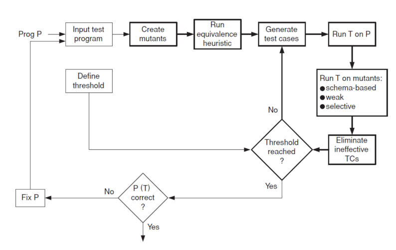

# LLM-Mutants: Analiza efektywności generowania operatorów mutacyjnych za pomocą dużych modeli językowych

**Kierunek**: Informatyka
**Specjalność**: Inżynieria Oprogramowania
**Numer albumu**: 1185432
**Autor**: Miraslau Douher
**Promotor:** dr. prof. Michał Mnich
**Uczelnia:** Uniwersytet Jagielloński
**Rok:** 2026

---

## Spis treści

- [Streszczenie](#streszczenie) (TO DO)

- [1 Wstęp](#rozdział-wstęp) (DONE)
  - [1.1 Temat i cel pracy](#temat-i-cel-pracy) (DONE)
  - [1.2 Budowa pracy](#budowa-pracy) (DONE)

- [2 Testowanie mutacyjne](#testowanie-mutacyjne) (DONE)
  - [2.1 Czym jest mutant?](#czym-jest-mutant) (DONE)
  - [2.2 Zabicie mutanta i mutation score](#zabicie-mutanta-i-mutation-score) (DONE)
  - [2.3 Proces testowania mutacyjnego krok po kroku](#proces-testowania-mutacyjnego-krok-po-kroku) (DONE)
  - [2.4 Koszty i problemy praktyczne](#koszty-i-problemy-praktyczne) (DONE)

- [3 Operatory mutacyjne w narzędziach klasycznych](#operatory-mutacyjne-w-narzędziach-klasycznych) (DONE)
  - [3.1 Czym jest PIT](#czym-jest-pit) (DONE)
  - [3.2 Katalog operatorów klasycznych](#katalog-operatorów-klasycznych) (DONE)
    - [3.2.1 Mutanty projektowe](#mutanty-projektowe) (DONE)
    - [3.2.2 Mutanty integracyjne](#mutanty-integracyjne) (DONE)
    - [3.2.3 Mutanty obiektowe](#mutanty-obiektowe) (DONE)
    - [3.2.4 Mutanty wykonywane na gramatyce](#mutanty-wykonywane-na-gramatyce) (DONE)
  - [3.3 Ograniczenia operatorów klasycznych](#ograniczenia-operatorów-klasycznych) (DONE)

- [4 LLM w testowaniu mutacyjnym](#llm-w-testowaniu-mutacyjnym) (DONE)
  - [4.1 Czym są LLM?](#czym-są-llm) (DONE)
  - [4.2 Zastosowania LLM jako generatora mutantów](#zastosowania-llm-jako-generatora-mutantów) (DONE)
  - [4.3 Zalety i ograniczenia LLM w testowaniu mutacyjnym](#zalety-i-ograniczenia-llm-w-testowaniu-mutacyjnym) (DONE)

- [5 Dane eksperymentalne i metryki](#dane-eksperymentalne-i-metryki) (DONE)
  - [5.1 Zbiór rzeczywistych błędów](#zbiór-rzeczywistych-błędów) (DONE)
  - [5.2 Rodzaje mutantów](#rodzaje-mutantów) (DONE)
    - [5.2.1 Compilable mutants](#compilable-mutants) (DONE)
    - [5.2.2 Duplicate mutants](#duplicate-mutants) (DONE)
    - [5.2.3 Equivalent mutants](#equivalent-mutants) (DONE)
  - [5.3 Metryki i kryteria oceny](#metryki-i-kryteria-oceny) (DONE)
    - [5.3.1 LLM New Mutant Rate](#llm-new-mutant-rate) (DONE)
    - [5.3.2 Real Bug Detection Rate](#real-bug-detection-rate) (DONE)
    - [5.3.3 Average Ochiai Rate](#average-ochiai-rate) (DONE)
    - [5.3.4 High Average Ochiai Rate](#high-average-ochiai-rate) (DONE)
    - [5.3.4 High Ochiai Mutant Rate](#high-ochiai-mutant-rate) (DONE)
    - [5.3.5 Coupling Rate](#coupling-rate) (DONE)
    - [5.3.6 Average Mutant Generation Time](#average-mutant-generation-time) (DONE)
    - [5.3.7 Cost per Useful Mutant](#cost-per-useful-mutant) (DONE)
  - [5.4 Cel pracy i pytania badawcze](#cel-pracy-i-pytania-badawcze) (DONE)

- [6 Założenia eksperymentu i metodyka](#założenia-eksperymentu-i-metodyka) (TO DO)
  - [6.1 Generacja mutantów](#generacja-mutantów) (TO DO)
  - [6.2 Przebieg eksperymentu](#przebieg-eksperymentu) (TO DO)
  - [6.3 Weryfikacja mutantów i zbieranie wyników](#weryfikacja-mutantów-i-zbieranie-wyników) (TO DO)

- [7 Analiza wyników i wnioski](#analiza-wyników-i-wnioski) (TO DO)
  - [7.1 Statystyki ogólne eksperymentu](#statystyki-ogólne-eksperymentu) (TO DO)
  - [7.2 RQ1 - Różnorodność i nowość mutantów LLM](#rq1---różnorodność-i-nowość-mutantów-llm) (TO DO)
  - [7.3 RQ2 - Podobieństwo mutantów do defektów rzeczywistych](#rq2---podobieństwo-mutantów-do-defektów-rzeczywistych) (TO DO)
  - [7.4 RQ3 - Koszty i wydajność podejścia](#rq3---koszty-i-wydajność-podejścia) (TO DO)
  - [7.5 Porównanie LLM vs PIT](#porównanie-llm-vs-pit) (TO DO)
  - [7.6 Ograniczenia badania](#ograniczenia-badania) (TO DO)

- [Podsumowanie i wnioski](#podsumowanie-i-wnioski) (TO DO)

- [Bibliografia](#bibliografia) (DONE)

## Streszczenie

> ✏️ **Wskazówka do pisania:** Streszczenie piszesz NA KOŃCU, gdy masz już wyniki.
> Napisz 8–12 zdań w następującej kolejności:
> (1) o czym jest praca, (2) jaki problem rozwiązujesz, (3) jak to sprawdzasz,
> (4) 2–3 najważniejsze wyniki liczbowe, (5) jedno zdanie wniosków.
> Bez detali technicznych. Ogólny opis „co i po co".

*[Do napisania jako ostatnie - po przeprowadzeniu eksperymentu i napisaniu pozostałych rozdziałów.]*

Praca dotyczy zastosowania dużych modeli językowych (LLM) do generowania operatorów mutacyjnych - reguł wprowadzania celowych błędów w kodzie źródłowym, służących do oceny jakości testów automatycznych. Klasyczne operatory mutacyjne, definiowane ręcznie w narzędziach takich jak PIT, stanowią ograniczony i statyczny katalog reguł, który może nie odzwierciedlać typów błędów rzeczywiście popełnianych przez programistów. Niniejsza praca weryfikuje, czy LLM są w stanie indukować nowe reguły mutacyjne wykraczające poza ten katalog oraz czy generowane przez nie mutanty są bliższe rzeczywistym defektom oprogramowania pod względem zachowania programu.

W ramach badania przeprowadzono jeden kompleksowy eksperyment na zbiorze błędów z repozytorium Defects4J: wygenerowano mutanty przy użyciu LLM oraz narzędzia PIT dla tych samych projektów Java, następnie każdy mutant poddano kompilacji i uruchomieniu relewantnego zestawu testów, a zebrane dane przeanalizowano pod kątem trzech tez badawczych dotyczących nowości mutantów, realizmu i wydajności podejścia LLM.

*[Uzupełnić po eksperymencie: X% użytecznych mutantów LLM nie posiadało odpowiednika wśród mutantów PIT. Mediana podobieństwa testowego (proximity) mutantów LLM do rzeczywistych błędów wyniosła Y, wobec Z dla mutantów PIT. Wyniki sugerują, że …]*

**Słowa kluczowe:** testowanie mutacyjne, operatory mutacyjne, duże modele językowe, LLM, PIT, Defects4J, mutation score, proximity to real bugs.

---

## Rozdział Wstęp

### Temat i cel pracy

Rozwój dużych modeli językowych (ang. *Large Language Models*, LLM) oraz narzędzi opartych na tej technologii doprowadził do szerokiego stosowania automatycznego generowania kodu w produkcji oprogramowania.
Takie podejście przyspiesza pracę inżynierów oprogramowania.
Wymaga jednak dokładniejszej weryfikacji dla osiągnięcia wystarczająco wysokiego poziomu pewności co do poprawności wygenerowanego kodu, co wciąż jest warunkiem koniecznym bezpiecznego wdrożenia.
Jedną z najlepszych metod oceny jakości testów jest stosowanie testowania mutacyjnego, polegające na wprowadzaniu drobnych zmian w kodzie i sprawdzaniu, czy istniejące testy potrafią je wykryć.
Klasyczne narzędzia mutacyjne dysponują jednak tylko niewielkim katalogiem operatorów, co ogranicza przestrzeń defektów rzeczywiście popełnianych przez programistów.

Z drugiej strony LLM, trenowane na większości dostępnych w internecie zbiorach kodu oraz historii bugów, posiadają szerszą wiedzę o defektach popełnianych w produkcyjnym oprogramowaniu.
Dzięki temu możliwe jest wykorzystanie LLM do generowania bardziej nieoczekiwanych oraz realistycznych mutantów.
Pozwala to wykraczać poza ograniczony zestaw reguł dostępnych w klasycznych narzędziach mutacyjnych, a tym samym zwiększać jakość testów.
Z kolei pozwala to wzmocnić poziom zaufania do oprogramowania, w tym do automatycznie wygenerowanego kodu.

Celem niniejszej pracy jest analiza efektywności generowania operatorów mutacyjnych przy użyciu LLM w porównaniu z operatorami klasycznymi.
W ramach badania zostaną przeanalizowane nowe operatory LLM, ich bliskość do rzeczywistych błędów oraz ich wydajność w porównaniu z operatorami klasycznymi.

### Budowa pracy

Wygląd zawartości rozdziałów przedstawionych w pracy:

- **Rozdział 1** Temat i cel pracy wraz z zawartością poszczególnych rozdziałów.
- **Rozdział 2** Definicja testowania mutacyjnego, mutation score, rodzaje mutantów oraz opis procesu testowania mutacyjnego.
- **Rozdział 3** Klasyczne operatory mutacyjne na przykładzie narzędzia PIT, zasada działania, katalog operatorów klasycznych z grupy ALL.
- **Rozdział 4** Duże modele językowe w inżynierii oprogramowania, testowaniu mutacyjnym, rola LLM jako generatora mutantów i zmian w kodzie oraz związane z tym ryzyka.
- **Rozdział 5** Rzeczywiste błędy jako podstawa eksperymentu - zbiór Defects4J 3.0.1, miary podobieństwa mutanta do defektu na podstawie profili testowych oraz kompletna definicja wszystkich metryk i kryteriów oceny stosowanych w badaniu. Następnie problem badawczy, cel pracy i pytania badawcze.
- **Rozdział 6** Metodyka eksperymentu: przebieg badania, generacja mutantów przez LLM i PIT, weryfikacja wyników oraz zbieranie danych do dalszej analizy metryk.
- **Rozdział 7** Analiza wyników eksperymentu, interpretacja danych liczbowych, odpowiedzi na tezy badawcze, porównanie LLM i PIT oraz ograniczenia badania.
- **Podsumowanie** Główne wnioski pracy.

## Testowanie mutacyjne

Testowanie mutacyjne to technika oceny tego, jak dobrze testy wykrywają defekty w kodzie.
Polega ona na celowym wprowadzaniu drobnych zmian w kodzie programu, a następnie na sprawdzaniu, czy testy są w stanie te zmiany wykryć.
Każda taka zmiana tworzy nową wersję kodu, zwaną mutantem, który jest następnie sprawdzany przez testy.
Dzięki temu można ocenić, jak dobrze testy sprawdzają logikę oraz wymagania programu i czy są w stanie wykryć potencjalne błędy w kodzie.

Ocena jakości testów automatycznych jest jednym z najważniejszych problemów inżynierii oprogramowania.
Najczęściej używanym sposobem oceny jest sprawdzenie tzw. pokrycia kodu (ang. *code coverage*), czyli tego, jaki procent kodu jest wykonywany podczas testów.
Jednak problem polega na tym, że nawet jeśli kod jest wykonywany, to niekoniecznie oznacza, że jest sprawdzany.
Test, który uruchamia metodę, ale nie sprawdza jej wyniku, może mieć 100% pokrycie kodu, ale nie dawać żadnej informacji o tym, czy program działa poprawnie i spełnia wymagania biznesowe.
Dlatego ważne jest sprawdzenie, czy testy są w stanie wykryć błąd, gdy taki się pojawi.

Pytanie, które pokrycie kodu pomija, brzmi, *czy testy rzeczywiście wykryją błąd, gdy taki się pojawi?*
Odpowiedzi na nie udziela testowanie mutacyjne.
Zamiast mierzyć, ile kodu zostało uruchomione, sprawdza się, czy testy potrafią odróżnić poprawne zachowanie programu od zachowania błędnego.
Osiąga się to przez celowe wprowadzanie drobnych zmian w kodzie mutantów oraz obserwowanie, czy istniejący zestaw testów te zmiany wykrywa.
Jeżeli zmiana przechodzi niezauważona, jest to sygnał, że testy nie sprawdzają skutecznie tego fragmentu logiki.

Testowanie mutacyjne jest zatem narzędziem oceny "siły" testów, a nie tylko ich *zasięgu*.
Jego użyteczność wynika właśnie z tego, że zadaje pytanie z perspektywy błędu zamiast pytać "co zostało wykonane?", pyta "co zostałoby wykryte, gdyby coś poszło nie tak?".
Zanim jednak możliwe będzie przeprowadzenie takiej oceny, należy zdefiniować, czym dokładnie jest mutant i jak przebiega jego analiza.

Odpowiedź na to pytanie daje testowanie mutacyjne.
Zamiast sprawdzać, jaki procent kodu jest wykonywany, testowanie mutacyjne sprawdza, czy testy są w stanie odróżnić poprawne zachowanie programu od błędnego.
Pozwala to ocenić nie tylko poprawność testu, ale również to, jak dobrze dany przypadek testowy został zdefiniowany.
Robi się to przez celowe wprowadzanie drobnych zmian w kodzie i sprawdzenie, czy testy te zmiany wykrywają.
Jeżeli zmiana nie zostanie wykryta, oznacza to, że testy nie są wystarczająco dobre.

Testowanie mutacyjne jest więc narzędziem, które pomaga ocenić, jak dobre są nasze testy, a nie tylko jaki jest ich zasięg.
Jego użyteczność wynika z tego, że pyta o to, co się stanie, gdy coś pójdzie nie tak, zamiast pytać, co zostało wykonane.
Aby móc przeprowadzić taką ocenę, trzeba najpierw zdefiniować, czym jest mutant i jak przebiega jego analiza.

### Czym jest mutant?

Mutant to specjalna wersja kodu, który powstaje przez wprowadzenie drobnej zmiany w oryginalnym kodzie.
Zmiana ta jest celowa i wynika z określonej reguły, która nazywa się operatorem mutacyjnym.
Definicja mutanta jest stosunkowo prosta, ale kryje w sobie kilka ważnych szczegółów.
- Po pierwsze, mutant różni się od oryginału tylko w jednym miejscu.
- Po drugie, zmiana jest celowa, a nie losowa. W klasycznym podejściu to określony operator mutacyjny.
- Po trzecie, mutant nie jest błędem, który występuje w systemie produkcyjnym, ale raczej sztuczną symulacją błędów, które mogą wystąpić w kodzie.
Z tego powodu symulacja ma być jak najbardziej podobna do prawdziwych błędów, żeby stosowanie testów mutacyjnych do oceniania jakości testów jednostkowych było efektywne.

Celem mutanta jest sprawdzenie, czy istniejące testy są w stanie wykryć błędy.
Typowe zmiany wprowadzane przez operatory mutacyjne to na przykład zamiana operatora `<` na `<=`, negacja warunku logicznego, usunięcie lub zastąpienia wywołania metody.
Każda z tych zmian symuluje inny rodzaj błędu i może pokazać słabość w zestawie testów.
Weryfikacja mutanta polega na uruchomieniu pełnego zestawu testów jednostkowych na zmutowanej wersji programu.
Jeśli co najmniej jeden test nie powiedzie się, mutant zostaje "zabity".
Jeśli wszystkie testy przejdą pomyślnie, mutant "przeżyje".
Przeżycie mutanta oznacza, że testy nie są wystarczająco dokładne w danym miejscu programu lub nawet niepoprawne.
Często jest to sygnałem, że testy nie sprawdzają odpowiednich wymagań kodu.
Wynik weryfikacji mutanta nie mówi nic o tym, czy kod jest poprawny, ale mówi, jak uważnie testy go obserwują.
Aby ocenić jakość testów, używa się metryki mutation score, która opisuje, jak mierzyć łączny wynik weryfikacji całego zbioru mutantów.

### Zabicie mutanta i mutation score

Gdy mutanty są wygenerowane, następuje ocena poprzez uruchomienie zbioru testów jednostkowych na zmodyfikowanym kodzie.
Na tym etapie sprawdzane jest, czy istniejące testy jednostkowe potrafią zidentyfikować, że w kodzie został wprowadzony defekt, który zmienia zachowanie programu.
Może to oznaczać, że mutant zawiera zarówno zmianę znaczącą, jak i prawie niewidoczną usterkę w kodzie.
Niezależnie od charakteru zmiany, jeżeli co najmniej jeden test zakończy się niepowodzeniem, oznacza to, że mutant został "zabity" (killed mutant).
Wskazuje to, że testy poprawnie reagują na modyfikacje w zachowaniu programu, które potencjalnie mogłyby być błędem w kodzie.

W innym przypadku, gdy testy jednostkowe nie wykryły zmian w kodzie, mutant jest klasyfikowany jako "przeżywający" (survived mutant).
Oznacza to, że testy niewystarczająco pokrywają kod albo nie sprawdzają odpowiednich wymagań, lub też zawierają błędy.
W każdym takim przypadku niewykrycie mutanta świadczy o słabości testów, co pozwala na estymację jakości zestawu testów oraz na wnioskowanie jakości kodu sprawdzanego przez te testy.

Dla liczbowej oceny efektywności zestawu testów w kontekście mutacyjnego testowania stosuje się metrykę mutation score.
Metryka ta pozwala określić, jaki procent mutantów, które udało się skompilować, został zabity przez zbiór testów jednostkowych.

Dokładny wzór:
```
mutation score = liczba zabitych mutantów / liczba skompilowanych mutantów
```

Dla jasności można rozważyć przykład. Jeżeli podczas testowania wygenerowano 100 mutantów.
Spośród nich 20 nie skompilowało się i zostało wykluczonych ze zbioru mutantów.
Na pozostałych 80 mutantach wykonano testy oraz 60 spośród nich zostało zabitych, a 20 przeżyło.
W tym przypadku mutation score = 60 / 80 = 75%.
Ten wynik oznacza, że zestaw testów wychwytuje 75% symulowanych błędów.
Generalnie wyższy mutation score sugeruje lepszą skuteczność testów w wykrywaniu potencjalnych bugów.
Z kolei niższa wartość sugeruje, że testy mogą wymagać poprawy, ponieważ nie wykrywają symulowanych błędów w kodzie.

Trzeba jednak pamiętać, że mutation score nie jest jednoznacznym miernikiem jakości testów jednostkowych.
Należy odczytywać tę metrykę wyłącznie w kontekście wygenerowanych mutantów, od których całkowicie zależą wyniki testowania mutacyjnego.
Na przykład duża liczba podobnych lub bardzo trywialnych mutantów może prowadzić do błędnych wniosków.
Do testów mutacyjnych trzeba podchodzić z ostrożnością, żeby poprawnie zinterpretować wyniki.

### Proces testowania mutacyjnego krok po kroku

Proces testowania mutacyjnego został po raz pierwszy opisany w 1978 roku przez DeMillo [5].
W praktyce cały proces składa się z kolejnych etapów, w których każdy następny krok jest uzależniony od wyniku etapu poprzedniego [2], [4].
Na początku generuje się tak zwany zbiór mutantów, po czym sprawdza się, czy są one poprawne pod względem technicznym, żeby można było uruchomić na nich testy.
Następnie przeprowadza się analizę wyników oraz interpretację danych, takich jak "mutation score" i inne ustalone metryki, w celu oceny jakości testów.



1. Na początku wybierany jest fragment kodu, który będzie analizowany. 
2. Generowany jest zbiór mutantów w celu symulowania potencjalnych błędów w kodzie.
3. Dla każdego wygenerowanego mutantu sprawdzana jest poprawność techniczna, najczęściej poprzez kompilację, tak aby do dalszego etapu trafiały jedynie mutanty możliwe do uruchomienia.
4. Dla mutantów, które przeszły ten etap, wykonywany jest zbiór testów w celu sprawdzenia, czy wprowadzona zmiana powoduje obserwowalną zmianę zachowania kodu.
5. Po zakończeniu testów mutant zostaje sklasyfikowany jako zabity, jeżeli co najmniej jeden test zakończy się niepowodzeniem, albo jako przeżywający, jeżeli cały zestaw testów przejdzie.
6. Kolejnym krokiem oblicza się mutation score, czyli procent zabitych mutantów, które przeszły etap sprawdzenia technicznego.
7. Na samym końcu przeprowadzana jest interpretacja wyników w celu oceny jakości testów oraz wskazania potencjalnych obszarów kodu, które wymagają poprawy/uzupełnienia testów.

### Koszty i problemy praktyczne

Największą przeszkodą w stosowaniu testowania mutacyjnego w praktyce jest wysoki koszt obliczeniowy oraz czasowy związany z generowaniem, kompilacją oraz uruchamianiem dużej liczby mutantów.
Każdy mutant wymaga osobnego sprawdzenia, dlatego łączny koszt analizy rośnie bardzo szybko.
Jeżeli projekt zawiera N testów oraz wygenerowano dla niego M mutantów, to liczba uruchomień rośnie w przybliżeniu proporcjonalnie do iloczynu N i M, co wprowadza znaczący narzut infrastrukturalny oraz czasowy.
Z tego powodu testowanie mutacyjne, mimo bardzo wartościowej informacji o jakości testów, jest w projektach produkcyjnych stosowane rzadko albo ograniczane tylko do najbardziej krytycznych modułów.

Jednym z podstawowych sposobów ograniczania tego kosztu jest zmniejszenie liczby analizowanych mutantów.
W literaturze [4] opisuje się mutant sampling (losowy wybór reprezentatywnego podzbioru mutantów) oraz selective mutation (ograniczenie analizy do operatorów uznawanych za najbardziej informatywne).
Takie podejście pozwala skrócić czas wykonania przy zachowaniu bardzo przybliżonej do oryginału oceny mutation score.
Dodatkowo współczesne narzędzia starają się przyspieszać analizę przez równoległość, ograniczanie liczby uruchamianych testów oraz mutację na poziomie bajtkodu JVM, co wykorzystuje między innymi PIT [1], [2].

Częściowym sposobem ograniczenia tego problemu może być także generowanie mutantów przy użyciu LLM.
W przeciwieństwie do klasycznych operatorów mutacyjnych, opartych na szerokim katalogu operatorów, LLM mogą potencjalnie generować mniejszą liczbę mutantów oraz bardziej zbliżonych do rzeczywistych błędów w kodzie.
W takim przypadku redukcja liczby kandydatów może obniżyć koszt dalszej kompilacji i uruchamiania testów.
Dodatkową zaletą jest to, że istnieją już małe, kwantyzowane LLM osiągające dobre wyniki w benchmarkach, dla których koszt obliczeniowy oraz czas pojedynczej generacji mogą być relatywnie niskie.
Oznacza to, że przy odpowiednio dobranym modelu i strategii selekcji mutantów podejście LLM może częściowo poprawić praktyczną opłacalność testowania mutacyjnego, zwiększając dostępność tego podejścia dla szerszego zakresu projektów produkcyjnych.

---

## Operatory mutacyjne w narzędziach klasycznych

Głównym celem operatorów mutacyjnych jest symulowanie typowych błędów w kodzie.
Klasyczne operatory mutacyjne to zbiór zdefiniowanych reguł transformacji kodu, których celem jest tworzenie sztucznych błędów o przewidywalnym charakterze.
Ich największą zaletą jest powtarzalność, ponieważ każdy operator opisuje jasno określony wzorzec zmiany, co pozwala na stosunkowo łatwą automatyzację oraz pełną kontrolę nad procesem generacji mutantów.
W tym rozdziale przedstawiono klasyczne operatory, realizowane za pomocą narzędzia PIT [1], jako rozpowszechnione i dobrze udokumentowane rozwiązanie.

### Czym jest PIT

PIT jest narzędziem do testowania mutacyjnego dla projektów napisanych w Javie.
W niniejszej pracy stanowi ono reprezentatywne źródło klasycznych operatorów mutacyjnych, ponieważ udostępnia zarówno publiczną dokumentację z definicjami operatorów, jak i otwarty kod źródłowy.
Pozwala to jednoznacznie określić, jakie mutanty są generowane, co będzie potrzebne w dalszej analizie.
W badaniu uwzględniono stabilne operatory dostępne w dokumentacji PIT bez operatorów eksperymentalnych, które w większości powtarzają stabilne operatory.

### Katalog operatorów klasycznych

W klasyfikacji operatorów mutacyjnych wykorzystano klasyfikację przedstawioną przez Ammanna i Offutta [4].
Na tej podstawie operatory PIT z grupy "ALL" uporządkowano według czterech rodzin, aby zdefiniować uporządkowaną listę klasycznych mutantów do porównania z mutantami wygenerowanymi przez LLM.

#### Mutanty projektowe

Mutanty projektowe stanowią zbiór modyfikacji kodu źródłowego, które symulują proste lokalne błędy w logice.
Obejmują one operacje arytmetyczne, inkrementacje, operatory relacyjne, operatory bitowe oraz literały występujące w obrębie jednej metody.

- `Conditionals Boundary` - służy do testowania poprawności warunków granicznych. Działa przez zamianę `<` na `<=`, `<=` na `<`, `>` na `>=` oraz `>=` na `>`.
- `Increments` - sprawdza poprawność aktualizacji zmiennych lokalnych. Działa przez zamianę inkrementacji na dekrementacje i odwrotnie.
- `Invert Negatives` - bada poprawność użycia znaku wartości numerycznych. Działa przez usunięcie negacji albo odwrócenie znaku zmiennej, ale nie mutuje ujemnych literałów.
- `Math` - odpowiada za mutacje operatorów arytmetycznych, bitowych i przesunięć. Obejmuje między innymi zamiany `+` na `-`, `*` na `/`, `%` na `*`, `&` na `|` oraz `<<` na `>>`.
- `Negate Conditionals` - służy do sprawdzania logiki porównań. Działa przez zamianę `==` na `!=`, `!=` na `==`, `<` na `>=`, `<=` na `>` oraz `>` na `<=`.
- `Inline Constant` - mutuje literały przypisane do zmiennych niefinalnych. W zależności od typu zmienia je na wartości graniczne albo zwiększa ich wartość.
- `Remove Increments` - usuwa inkrementację lokalnych zmiennych.

Mutanty projektowe są w katalogu PIT najliczniejsze.
Wynika to z faktu, że klasyczne testowanie mutacyjne historycznie skupiało się na drobnych błędach w obrębie pojedynczej jednostki kodu, takich jak błędna granica porównania albo niewłaściwa modyfikacja zmiennej lokalnej.

#### Mutanty integracyjne

Mutanty integracyjne stanowią zbiór modyfikacji kodu źródłowego, które badają poprawność współpracy między metodami oraz przepływu wartości pomiędzy komponentami kodu.

- `Void Method Call` - usuwa wywołania metod typu `void`. Pozwala to sprawdzić, czy testy wykrywają brak efektu ubocznego operacji, która nic nie zwraca.
- `Non Void Method Calls` - usuwa wywołania metod zwracających wartość oraz zastępuje ich wynik domyślną wartością Javy dla danego typu, na przykład `0`, `false`, `0.0` albo `null`.
- `Argument Propagation` - zastępuje całe wywołanie metody jednym z jego argumentów o zgodnym typie. Bada to pominięcie logiki metody i dalsze użycie wartości wejściowej.

Jeżeli usunięcie wywołania metody albo zastąpienie przekazywanych parametrów nie wpływa na wynik testów, może to oznaczać, że integracja między elementami programu nie jest wystarczająco dobrze przetestowana.

#### Mutanty obiektowe

Mutanty obiektowe stanowią zbiór modyfikacji kodu źródłowego, które symulują błędy związane z korzystaniem z mechanizmów obiektowych.

- `Constructor Calls` - zastępuje wywołanie konstruktora wartością `null`. Służy do badania odporności programu na brak poprawnie zainicjalizowanego obiektu.
- `Big Integer` - zamienia wywołania metod na obiektach `BigInteger`. Reprezentuje to błędy w użyciu obiektowego API liczbowego.
- `Big Decimal` - zamienia wywołania metod na obiektach `BigDecimal`. Reprezentuje to błędy w użyciu obiektowego API liczbowego dla liczb dziesiętnych.
- `Member Variable` - usuwa przypisania do pól obiektów, także pól finalnych, przez co pola przyjmują domyślne wartości Javy.
- `Naked Receiver` - zastępuje wywołanie metody samym odbiorcą wywołania, co oznacza pominięcie logiki tej metody przy zachowaniu obiektu.

Choć PIT nie implementuje całego katalogu klasycznych operatorów obiektowych znanych z literatury, zawiera wystarczająco reprezentatywną grupę związaną z programowaniem obiektowym.

#### Mutanty wykonywane na gramatyce

Mutanty wykonywane na gramatyce obejmują takie modyfikacje, które symulują błędy przepływu sterowania albo zwracania wyniku z metody.
W odróżnieniu od mutacji projektowych nie dotyczą one wyłącznie pojedynczego operatora, lecz wpływają na semantykę instrukcji `return`, `if` lub `switch`.

- `Empty Returns` – zastępuje wynik metody odpowiadającą mu pustą reprezentacją. W praktyce może to być pusty napis, pusta kolekcja, `Optional.empty()` albo wartość zero. Operator ten pozwala sprawdzić, czy testy odróżniają wynik rzeczywisty od poprawnego składniowo, ale semantycznie pustego.
- `False Returns` – wymusza zwracanie `false` dla wartości logicznych. Jest użyteczny tam, gdzie poprawność programu zależy od pojedynczych decyzji logicznych zwracanych przez metodę.
- `True Returns` –  wymusza zwracanie `true` dla wartości logicznych. Jest analogiczny do `False Returns`.
- `Null Returns` – zastępuje zwracany obiekt wartością `null`. Operator ten pozwala sprawdzić, czy testy poprawnie sprawdzają brak oczekiwanego obiektu.
- `Primitive Returns` – zastępuje prymitywne wartości zwracane przez `0`. Dzięki temu bada, czy testy odróżniają wynik obliczenia od wartości domyślnej dla typu numerycznego.
- `Remove Conditional` – usuwa znaczenie warunku i wymusza wykonanie albo pominięcie gałęzi `if` lub `else`. Dokumentacja PIT wyróżnia tu specjalizacje dla warunków równościowych i porządkowych oraz dla gałęzi, która ma zostać wymuszona. Mutator ten sprawdza, czy testy są wrażliwe na sam wybór ścieżki wykonania programu.
- `Switch` – mutuje instrukcję `switch` przez zastąpienie etykiety domyślnej pierwszą etykietą jawną, a pozostałych etykiet wartością `default`.
- `Remove Switch` – usuwa wybrane etykiety `case` w `switch`, zamieniając z gałęzią domyślną.

Wspólną cechą tych mutantów jest to, że mutacje obejmują konstrukcje składniowe odpowiedzialne za wybór ścieżki wykonania albo za zwracanie wartości z metody.
Pozwala to badać, czy testy wykrywają błędy związane nie tylko z lokalnym operatorem, lecz również z błędną strukturą sterowania.

### Ograniczenia operatorów klasycznych

Mimo tego, że PIT ma bogaty katalog, nadal jest narzędziem opartym na skończonym zbiorze ręcznie zdefiniowanych reguł zaprojektowanych przez autorów narzędzia.
Każdy operator opisuje tylko taki rodzaj zmiany, jaki przewidzieli jego twórcy.
Dlatego przestrzeń możliwych defektów jest symulowana przez stosunkowo ograniczony obszar mutantów.
W praktyce oznacza to, że PIT nie tworzy zmian wyraźnie zależnych od znaczenia całego fragmentu programu, lecz od wzorca rozpoznanego przez konkretny mutator.
Jest to istotne, ponieważ właśnie poza tym obszarem mogą pojawiać się nowe operatory generowane przez LLM, które będą lepiej symulować rzeczywiste błędy w kodzie.
Ograniczona różnorodność transformacji w podejściu klasycznym stanowi więc jedną z głównych przyczyn dla badania LLM jako generatora mutantów.

---

## LLM w testowaniu mutacyjnym

Klasyczne operatory mutacyjne opierają się na skończonym, z góry zdefiniowanym zbiorze operatorów.
Z tego powodu zakres generowanych przez nie mutantów jest ograniczony do zmian realizowanych przez te operatory
Z kolei LLM są znacznie większą klasę narzędzi, ponieważ generują kod na podstawie zależności statystycznych wyuczonych z dużych zbiorów danych.
W zastosowaniach związanych z testowaniem mutacyjnym [6] istotne są takie właściwości jak zdolność do uwzględniania kontekstu, możliwość generowania zmian podobnych do rzeczywistych błędów oraz syntaktycznie poprawnego kodu.
Właściwości te pozwalają traktować LLM jako narzędzie, które może efektywniej generować zmiany w kodzie odzwierciedlające rzeczywiste błędy.

### Czym są LLM?

Duże modele językowe (*Large Language Models*, LLM) są klasą modeli głębokiego uczenia trenowanych na ogromnych zbiorach danych.
Ich działanie jest oparte na modelowaniu zależności między elementami sekwencji oraz przewidywaniu najbardziej prawdopodobnego następnego tokenu na podstawie poprzedniego tekstu.
Współczesne LLM oparte na architekturze transformera, co pozwala im uwzględniać relacje między odległymi elementami wejściowymi i przetwarzać długie fragmenty tekstu w spójny sposób.
W praktyce umożliwia to generowanie, uzupełnianie, streszczanie i przekształcanie treści, w tym również kod, który traktowany jest jako strukturalny tekst, podlegający regułom syntaktycznym, zależnościom typów i wzorcom implementacyjnym.
W kontekście zastosowań mutacyjnych potrafią one generować zmiany, które są formalnie poprawne w danym miejscu w kodzie, a jednocześnie mogą prowadzić do innego zachowania programu.

### Zastosowania LLM jako generatora mutantów

W inżynierii oprogramowania LLM są wykorzystywane do analizy, generowania i modyfikacji kodu.
Obejmuje to uzupełnianie implementacji, wyjaśnianie działania istniejących fragmentów kodu, tworzenie dokumentacji, przygotowywanie testów oraz wspieranie przeglądu kodu.
Wspólną cechą tych zastosowań jest działanie na fragmentach kodu, których poprawność zależy nie tylko od pojedynczych elementów składniowych, ale również od relacji między instrukcjami, typami i przepływem sterowania.

Ta sama właściwość ma znaczenie w testowaniu mutacyjnym, gdzie istotne jest generowanie zmian możliwych do zastosowania w konkretnym miejscu programu, takich, aby mogły wpłynąć na jego zachowanie.
Z tego względu LLM mogą być rozpatrywane jako efektywne narzędzie do generowania mutantów w kodzie.
Model otrzymuje fragment programu oraz prompt opisujący oczekiwaną transformację.
Takie podejście umożliwia generowanie mutantów bez konieczności uprzedniego definiowania każdej reguły mutacyjnej w postaci osobnego operatora.
Zamiast tego model wykorzystuje kontekst, relacje między instrukcjami kodu oraz dane treningowe.

### Zalety i ograniczenia LLM w testowaniu mutacyjnym

Zastosowanie LLM w testowaniu mutacyjnym otwiera nowe możliwości do generowania mutantów, które nie są ograniczone do klasycznego katalogu operatorów.
Najważniejszą zaletą tego podejścia jest większa elastyczność tworzenia zmian, które są dostosowane do kontekstu programu.
Może to prowadzić do większej różnorodności analizowanych defektów oraz generowania mutantów bliższych rzeczywistym błędom.
Podejście to może być również przydatne, gdy celem jest wygenerowanie mniejszej liczby zmian, ale o większej wartości diagnostycznej.

Jednakże, ograniczenia tego podejścia wynikają z mniejszej przewidywalności samego procesu generacji w porównaniu do klasycznych operatorów.
Wygenerowane mutanty w dużym stopniu zależą od modelu, promptu i parametrów uruchomienia, a same zmiany mogą okazać się niekompilowalne albo zduplikowane.
Pod tym względem wykorzystanie LLM w testowaniu mutacyjnym wymaga dodatkowej filtracji oraz walidacji.

---

## Dane eksperymentalne i metryki

Zanim przejdziemy do szczegółowego opisu eksperymentu, należy najpierw odpowiedzieć na pytanie, w jaki sposób ocenić, czy mutanty wygenerowane przez LLM są rzeczywiście lepsze od mutantów klasycznych.
Taka ocena wymaga zbioru rzeczywistych błędów, względem którego można analizować stopień realizmu mutantów, a także zastosowania odpowiednich metryk porównawczych.
W tym rozdziale zostanie przedstawiony zbiór defektów wykorzystany w badaniu, a potem zdefiniowane zostaną metryki służące do określania podobieństwa mutanta do rzeczywistego błędu.

### Zbiór rzeczywistych błędów

Oceniając jakość oprogramowania, kluczowa jest analiza zbioru udokumentowanych, rzeczywistych defektów, które faktycznie wystąpiły w kodzie produkcyjnym, zostały zgłoszone, a następnie naprawione przez programistów.
Zbiory te, znane jako repozytoria błędów, różnią się od standardowych zestawów testowych, ponieważ przechowują trzy kluczowe komponenty dla każdego błędu.
Po pierwsze, istnieje "wersja z błędami" kodu, która zawiera defekt w jego oryginalnym stanie, jeszcze przed naprawą.
Po drugie, mamy "wersję naprawioną" kodu, w której błąd został rozwiązany w sposób, który pozwala na porównanie zachowania programu przed i po naprawie.
Po trzecie, istnieją "testy jednostkowe", które kończą się niepowodzeniem po uruchomieniu wersji z błędami oraz kończą się powodzeniem w naprawionej wersji.
To ustrukturyzowane podejście pozwala na odtworzenie zachowania programu z obecnym błędem oraz porównanie jego z zachowaniem wygenerowanego mutanta.

Źródłem danych w tym badaniu jest **Defects4J** w wersji 3.0.1 [3]. 
Defects4J to zestaw 854 błędów z 17 projektów Java open-source, który jest utrzymywany przez naukowców od 2014 roku.
Dla każdego błędu mamy dostęp do wersji kodu z błędem oraz wersji naprawionej.
Co więcej, w celu ułatwienia analizy dostępna jest lista zmodyfikowanych klas, która pokazuje, które pliki zostały zmienione w wersji poprawionej.
Dostępny jest także zestaw nazw testów oraz możliwość automatycznego kompilowania i uruchamiania testów bez ręcznej konfiguracji środowiska.
Każdy błąd został zgłoszony w systemie śledzenia zgłoszeń, a następnie naprawiony w jednym zatwierdzeniu. 
Kod każdego błędu został ręcznie minimalizowany w taki sposób, żeby usunąć zmiany, które nie były związane z defektem, takie jak refaktoryzacja, czyli nowe funkcje.
Zgodnie z dokumentacją dla każdego błędu istnieje przynajmniej jeden test, który zawsze kończy się niepowodzeniem niezależnie od kolejności wywołania testów.

| Identyfikator   | Projekt                | Liczba aktywnych bugów | IDs aktywnych bugów          |
|-----------------|------------------------|------------------------|------------------------------|
| Chart           | jfreechart             | 26                     | 1–26                         |
| Cli             | commons-cli            | 39                     | 1–5, 7–40                    |
| Closure         | closure-compiler       | 174                    | 1–62, 64–92, 94–176          |
| Codec           | commons-codec          | 18                     | 1–18                         |
| Collections     | commons-collections    | 28                     | 1–28                         |
| Compress        | commons-compress       | 47                     | 1–47                         |
| Csv             | commons-csv            | 16                     | 1–16                         |
| Gson            | gson                   | 18                     | 1–18                         |
| JacksonCore     | jackson-core           | 26                     | 1–26                         |
| JacksonDatabind | jackson-databind       | 110                    | 1–64, 66–88, 90–112          |
| JacksonXml      | jackson-dataformat-xml | 6                      | 1–6                          |
| Jsoup           | jsoup                  | 93                     | 1–93                         |
| JxPath          | commons-jxpath         | 22                     | 1–22                         |
| Lang            | commons-lang           | 61                     | 1, 3–17, 19–24, 26–47, 49–65 |
| Math            | commons-math           | 106                    | 1–106                        |
| Mockito         | mockito                | 38                     | 1–38                         |
| Time            | joda-time              | 26                     | 1–20, 22–27                  |
| **Razem**       |                        | **854**                | –                            |

Projekty reprezentują szerokie spektrum dziedzin, od bibliotek narzędziowych (Lang, Math, Collections), przez parsery i kodeki (Jsoup, Gson, JacksonCore, JacksonDatabind, Codec), aż po kompilatory (Closure) i narzędzia ogólnego przeznaczenia (Compress, Csv, Cli). Różnorodność dziedzin zapewnia, że wyniki nie są specyficzne dla jednego rodzaju kodu i mogą stanowić podstawę wniosków ogólniejszej natury. Ze względu na koszty wywołań interfejsu API modelu językowego i czas uruchomienia testów, spośród dostępnych błędów wybierana jest reprezentatywna próba spełniająca zdefiniowane kryteria selekcji.

Projekty obejmują różne rodzaje aplikacji, takie jak biblioteki pomocnicze (Lang, Math, Collections), parsery (Jsoup, Gson, JacksonCore, JacksonDatabind i Codec), kompilator (Closure) oraz narzędzia ogólnego przeznaczenia (Compress, Csv i Cli).
Taka różnorodność aplikacji pozwala uzyskać wyniki, które nie dotyczą tylko jednego rodzaju kodu, lecz mogą stanowić podstawę wniosków o szerszym zakresie.
Ze względu na koszty połączeń z modelem językowym oraz czas potrzebny na wykonanie testów wybrana zostanie jedynie reprezentatywna grupa błędów.
W dalszej części rozdziału termin defekt oznacza pojedynczy rzeczywisty błąd pochodzący z tego zbioru.

### Rodzaje mutantów

Dla przeprowadzenia badania trzeba zdefiniować rodzaje mutantów, na podstawie których będą liczone metryki dla odpowiedzi na tezy badawcze.

#### Compilable mutants

Mutant kompilowany to wersja kodu, która po wprowadzeniu mutacji przechodzi poprawnie etap kompilacji.
Oznacza to brak błędów strukturalnych, syntaktycznych, niezgodności typów oraz brakujących symboli, które uniemożliwiałyby uruchomienie testów na zmodyfikowanym kodzie.
W badaniu wszystkie wygenerowane mutanty, zarówno klasyczne, jak i wygenerowane przez LLM, są poddawane próbie kompilacji w konfiguracji projektu.
Mutanty niekompilowane nie będą uczestniczyć w metrykach opartych na uruchamianiu testów, ponieważ nie można uruchomić na nich testów.

Metryka jest zdefiniowana jako liczba mutantów, które można skompilować, podzielona przez całkowitą liczbę wygenerowanych mutantów.
```
Compilability Mutation Rate (CMR) = liczba mutantów, które można skompilować / liczba wygenerowanych mutantów
```

Ta metryka będzie używana do obliczenia liczby mutantów możliwych do użycia w testowaniu, ponieważ LLM nie może gwarantować poprawnej generacji mutantów.
Będzie to potrzebne do oceniania stabilności generowania mutantów przez LLM, a także do porównania z klasycznymi mutantami, które charakteryzują się bardzo wysoką kompilowalnością lub 100% dla niektórych klasycznych narzędzi.

#### Duplicate mutants

Mutant zduplikowany to mutant, który syntaktycznie jest identyczny z innym mutantem albo z oryginalnym kodem.
Takie mutanty nie wprowadzają nowego zachowania i nie wnoszą nowych danych do analizy, ponieważ ich efekt został już uwzględniony.
Przed obliczaniem metryk usuwa się je ze zbioru, aby nie zawyżały wyników niektórych metryk.

Algorytm identyfikacji duplikatów polega na porównaniu reprezentacji kodu wygenerowanego mutanta po normalizacji z oryginalnym kodem oraz już istniejącymi mutantami.
Jeżeli dwie reprezentacje mutantów są identyczne względem siebie, oba mutanty traktowane są jako duplikaty tej samej modyfikacji.
Jeżeli mutant jest identyczny z oryginałem, oznacza się go jako duplikat.
Po ich usunięciu pozostaje zbiór mutantów unikalnych, który wraz z warunkiem kompilowalności stanowi podstawę do obliczania dalszych metryk.

```
Duplication Mutation Rate (DMR) = liczba mutantów zduplikowanych / liczba mutantów kompilowalnych
```

Wskaźnik ten pokazuje, jaki odsetek mutantów kompilowanych stanowią duplikaty.

#### Equivalent mutants

Mutant ekwiwalentny to mutant, który mimo różnic syntaktycznych zachowuje się w taki sam sposób jak oryginalny kod.
Oznacza to, że żaden test nie jest w stanie wykryć wprowadzonej zmiany, ponieważ nie prowadzi ona do obserwowalnej różnicy w zachowaniu kodu.
Nie istnieje uniwersalny algorytm rozpoznawania mutantów ekwiwalentnych, ponieważ problem ten jest nierozstrzygalny w ogólnym przypadku, dlatego w analizie będą stosowane przybliżone metryki oparte na wynikach testów.
Za mutanty ekwiwalentne uznaje się mutanty kompilowane i niezduplikowane, które przeżywają cały dostępny zestaw testów.
Podejście daje wyniki przybliżone, bo mutanty mogą przeżywać testy z powodu ich niedostatecznego pokrycia, a nie faktycznej ekwiwalentności semantycznej.
Choć takie podejście nie daje dokładnych wyników, ale pozwala porównać efektywność generacji mutantów, co w naszym przypadku jest wystarczające.

```
Equivalent Mutation Rate (EMR) = liczba mutantów przeżywających / (liczba mutantów kompilowalnych - liczba duplikatów)
```

### Metryki i kryteria oceny

Ocena mutantów opiera się na trzech najważniejszych kryteriach: stopniu różnorodności względem mutantów generowanych przez LLM oraz klasyczne narzędzia, poziomie podobieństwa do rzeczywistych błędów w kodzie, efektywności generacji mutantów, uwzględniając koszt oraz czas potrzebny do ich generacji.

W dalszej części rozdziału termin "mutant" oznacza mutanta kompilowalnego i niezduplikowanego.

#### LLM New Mutant Rate

*LLM New Mutant Rate* (LLM-NMR) mierzy, jaka część mutantów generowanych przez LLM nie ma odpowiednika wśród mutantów klasycznych.
Wskaźnik pozwala ocenić, czy LLM generuje nowe typy mutantów nieobecne w katalogu klasycznych operatorów.

Mutant LLM liczy się za nowy, gdy spełnia jednocześnie:
1. Nie powtarza żadnej zmiany wprowadzonej przez klasycznego mutanta w tej samej linijce kodu (brak odpowiednika syntaktycznego po normalizacji).
2. Nie istnieje mutant klasyczny wywołujący ten sam zestaw nieprzechodzących testów (brak odpowiednika w profilu testowym).

```
LLM-NMR = liczba mutantów LLM bez odpowiednika wśród mutantów klasycznych / liczba wszystkich użytecznych mutantów LLM
```

Wysoka wartość wskaźnika oznacza, że LLM generuje dużo mutantów nieobecnych w katalogu klasycznym; niska, że generowane mutanty w znaczącej mierze pokrywają się z istniejącymi operatorami klasycznymi.

#### Real Bug Detection Rate

*Real Bug Detection Rate* (RBDR) mierzy, dla jakiej części rzeczywistych defektów można znaleźć co najmniej jednego mutanta, który wykazuje częściową zgodność profilu testowego z danym defektem.
Kluczowym elementem tej metryki jest porównanie dwóch zbiorów testów: profilu testowego mutanta oraz defektu.
Profil mutanta definiowany jako zbiór testów nieprzechodzących po wprowadzeniu mutacji, a profil defektu obejmuje testy, które nie przechodzą dla wersji kodu z bugiem, ale przechodzą dla naprawionej wersji.
Na przykład, jeśli profil defektu zawiera testy `T1` i `T2`, a istnieje mutant powodujący niepowodzenie testu `T1`, to taki rzeczywisty defekt jest uznawany za wykryty. 

```
RBDR = liczba defektów wykrytych przez co najmniej jeden mutant / liczba wszystkich analizowanych defektów
```

Wysoka wartość RBDR oznacza, że dla wielu rzeczywistych defektów istnieją mutanty, które powodują niepowodzenie co najmniej części tych samych testów, co wskazuje na to, że odzwierciedlają one zachowanie rzeczywistych błędów.

#### Average Ochiai Rate

*Average Ochiai Rate* (AOR) mierzy, w jakim stopniu mutanty pokrywają się z profilami testowymi rzeczywistych defektów.
Kluczowym aspektem oceny jest porównanie dwóch zbiorów testów: profilu mutanta oraz profilu defektu.
W przeciwieństwie do `RBDR`, który jest metryką binarną, `AOR` odzwierciedla stopień tej zależności.
Im większa część testów wykrywających defekt znajduje się również w profilu mutanta, tym wyższa jest wartość tej metryki.

```
AOR = średnia(liczba wspólnych testów nieprzechodzących / pierwiastek z (liczba testów nieprzechodzących mutanta × liczba testów wykrywających defekt))
```

Wyższa wartość `AOR` oznacza, że profile niepowodzeń mutantów są bardziej zbliżone do profili testowych rzeczywistych defektów.

#### High Average Ochiai Rate

*High Average Ochiai Rate* (HAOR) mierzy, dla jakiej części defektów średnia wartość współczynnika Ochiai przekracza ustalony próg 0.8.
Kluczowym aspektem tej metryki jest identyfikacja defektów, dla których większość mutantów wykazuje wysokie podobieństwo do rzeczywistych błędów, co oznacza, że zbiór mutantów dobrze odwzorowuje ich zachowanie.
W przeciwieństwie do AOR, który uśrednia wartości Ochiai dla wszystkich defektów, HAOR pokazuje odsetek defektów, które spełniają kryterium wysokiej zgodności.

```
HAOR = liczba defektów, dla których średni Ochiai ≥ próg / liczba wszystkich defektów
```

Wyższa wartość `HAOR` oznacza, że dla większej części defektów wygenerowany zbiór mutantów jest bardzo podobny do rzeczywistych defektów.

#### High Ochiai Mutant Rate

*High Ochiai Mutant Rate* (HOMR) mierzy odsetek mutantów wartość współczynnika Ochiai przekracza ustalony próg 0.8.
Kluczowym aspektem tej metryki jest identyfikacja mutantów, które indywidualnie wykazują wysoki stopień podobieństwa do rzeczywistych błędów.
W przeciwieństwie do AOR oraz HAOR, które analizują podobieństwo na poziomie defektów, HOMR pozwala określić, jaka część wygenerowanych mutantów reprezentuje rzeczywiste błędy, pomijając te mutanty, które nie odzwierciedlają zachowania rzeczywistych defektów.

```
HOMR = liczba mutantów, dla których Ochiai ≥ próg / liczba wszystkich użytecznych mutantów
```

Wyższa wartość `HOMR` oznacza, że większa część wygenerowanych mutantów wykazuje wysokie podobieństwo do rzeczywistych błędów.

#### Coupling Rate

*Coupling Rate* (CR) mierzy, dla jakiej części użytecznych mutantów można znaleźć powiązanie z profilem testowym rzeczywistego defektu, dla którego dany mutant został wygenerowany.
Kluczowym elementem oceny jest porównanie dwóch zbiorów testów: profilu mutanta oraz profilu defektu.
Mutant jest powiązany z defektem, jeśli powoduje niepowodzenie co najmniej jednego testu z profilu tego defektu.

```
CR = liczba użytecznych mutantów powiązanych z odpowiadającym im defektami / liczba wszystkich użytecznych mutantów
```

W odróżnieniu od `RBDR`, który ocenia pokrycie od strony defektów, `CR` pokazuje, jaka część mutantów jest rzeczywiście związana z zachowaniem błędów w programie.

#### Average Mutant Generation Time

*Average Mutant Generation Time* (AMGT) mierzy średni czas potrzebny do wygenerowania jednego mutanta.
Podstawą oceny jest łączny czas etapu generacji oraz całkowita liczba wygenerowanych mutantów.
Dla LLM czas ten obejmuje okres od wysłania zapytania do modelu do uzyskania pełnej odpowiedzi.

```
AMGT = łączny czas generacji / liczba wszystkich wygenerowanych mutantów
```

Niższa wartość `AMGT` oznacza szybsze wytwarzanie pojedynczych mutantów i mniejszy koszt czasowy etapu generacji mutantów.

#### Cost per Useful Mutant

*Cost per Useful Mutant* (CPUM) mierzy koszt czasowy uzyskania jednego użytecznego mutanta, czyli mutanta kompilowalnego i niezduplikowanego.

```
CPUM = łączny czas generacji / liczba mutantów kompilowalnych i niezduplikowanych
```

Niższa wartość `CPUM` oznacza, że dane podejście szybciej generuje mutanty przydatne do dalszego uruchomienia oraz analizy.

### Cel pracy i pytania badawcze

Celem tej pracy jest weryfikacja, czy LLM mogą generować nowe mutanty, których nie można uzyskać za pomocą klasycznych operatorów mutacyjnych.
Dodatkowo analizowane jest, czy te wygenerowane mutanty są bardziej zbliżone do rzeczywistych defektów w programie w porównaniu do generowanych przy użyciu klasycznych narzędzi, a także jakie są koszty i ograniczenia podejścia opartego na LLM.

Badanie odpowiada na trzy pytania badawcze:

RQ1 - Czy możliwe jest generowanie nowych mutantów przy użyciu LLM, wykraczających poza klasyczny katalog operatorów mutacyjnych?

Pytanie dotyczy różnorodności: czy LLM w ogóle mogą wykroczyć poza zdefiniowany katalog klasycznych operatorów mutacyjnych.
Odpowiada na nie metryka *LLM New Mutant Rate* (LLM-NMR), która mierzy procent mutantów LLM nieposiadających odpowiednika wśród mutantów klasycznych wygenerowanych dla tego samego defektu.
Wysoka wartość LLM-NMR oznacza, że LLM generuje nowe mutanty, niedostępne w katalogu klasycznym.

RQ2 - Czy mutanty LLM są bliższe rzeczywistym defektom niż mutanty klasyczne?

Pytanie dotyczy realizmu: czy mutanty LLM wywołują niepowodzenia testów podobne do tych, które wywołuje rzeczywisty błąd.
Odpowiadają na nie trzy metryki. *Real Bug Detection Rate* (RBDR) mierzy, dla jakiej części analizowanych defektów istnieje co najmniej jeden mutant mający zgodny profil z defektem.
*Average Ochiai Rate* (AOR) wyraża średni stopień podobieństwa między profilem testowym mutanta a profilem rzeczywistego defektu.
*Coupling Rate* (CR) mierzy, jaki odsetek wszystkich mutantów jest powiązany z profilem testowym odpowiadającego im defektu.
Łączna analiza RBDR, AOR i CR pozwala ocenić, które z podejść generuje mutanty lepiej symulujące rzeczywiste defekty programów.

RQ3 - Czy mutanty generowane przez LLM są bardziej wydajne od bliskich klasycznych odpowiedników?

Pytanie dotyczy efektywności: ile kosztuje uzyskanie mutanta do uruchamiania testów, jak duży jest odsetek mutantów, które zostały odrzucone podczas filtracji, oraz jaki jest koszt czasowy potrzebny na generowanie zestawu mutantów.
Odpowiedzi na te pytania dostarczają metryki: *Compilability Mutation Rate* (CMR), *Duplication Mutation Rate* (DMR) i *Equivalent Mutation Rate* (EMR).
Te metryki opisują kolejno odsetek mutantów, które przeszły kompilację, odsetek duplikatów syntaktycznych wśród mutantów kompilowalnych oraz odsetek użytecznych mutantów, które nie zostały wykryte przez cały zestaw testów
Wskaźniki kosztowe, takie jak *Average Mutant Generation Time* (AMGT) i *Cost per Useful Mutant* (CPUM), mierzą odpowiednio średni czas generacji jednego mutanta oraz efektywny koszt uzyskania jednego użytecznego mutanta, uwzględniając straty na etapie filtracji.

Poniższa tabela zbiera wszystkie wskaźniki w formie zestawienia:

| Metryka                        | Skrót   | Co mierzy                                                                      | Powiązane RQ |
|--------------------------------|---------|--------------------------------------------------------------------------------|--------------|
| LLM New Mutant Rate            | LLM-NMR | Odsetek mutantów LLM bez odpowiednika wśród mutantów klasycznych               | RQ1          |
| Real Bug Detection Rate        | RBDR    | Odsetek defektów, dla których istnieje co najmniej jeden powiązany mutant      | RQ2          |
| Average Ochiai Rate            | AOR     | Średni stopień podobieństwa profili testowych mutanta i defektu                | RQ2          |
| High Average Ochiai Rate       | HAOR    | Odsetek defektów, dla których wartość średniej Ochiai przekracza ustalony próg | RQ2          |
| High Ochiai Mutant Rate        | HOMR    | Odsetek mutantów, dla których wartość Ochiai przekracza ustalony próg          | RQ2          |
| Coupling Rate                  | CR      | Odsetek mutantów powiązanych z profilem odpowiadającego im defektu             | RQ2          |
| Compilability Mutation Rate    | CMR     | Odsetek wygenerowanych mutantów, które przeszły kompilację                     | RQ3          |
| Duplication Mutation Rate      | DMR     | Odsetek duplikatów syntaktycznych wśród kompilowalnych mutantów                | RQ3          |
| Equivalent Mutation Rate       | EMR     | Odsetek mutantów przeżywających pełny zestaw testów                            | RQ3          |
| Average Mutant Generation Time | AMGT    | Średni czas wytworzenia jednego mutanta                                        | RQ3          |
| Cost per Useful Mutant         | CPUM    | Efektywny koszt uzyskania jednego użytecznego mutanta                          | RQ3          |

Pytania badawcze są wzajemnie uzupełniające: RQ1 bada różnorodność, RQ2 bada realizm, RQ3 bada efektywność procesu generacji.

---

## Założenia eksperymentu i metodyka

Celem tego eksperymentu jest porównanie efektywności mutantów wygenerowanych przez modele językowe z klasycznymi metodami generacji.
W związku z tym dla każdego analizowanego defektu [3] generowany jest zbiór mutantów, na których są uruchomione testy, które stanowią podstawę dla dalszych obliczeń i interpretacji metryk.
Podczas uruchamiania testów dla każdego mutanta są zbierane wyniki testów, czas potrzebny dla generacji, uruchomienia wraz z informacją o niepowodzeniu kompilacji, błędy wykonania kodu oraz duplikatach mutantów.
Zebrany zestaw danych pozwoli policzyć wszystkie metryki oraz uwzględnić koszt, jakość, podobieństwo do rzeczywistych defektów oraz ocenić efektywność różnych podejść w analizie testów dla wytwarzania oprogramowania.

### Generacja mutantów

[//]: # (Generacja mutantów w niniejszym badaniu jest ograniczona do tych metod programu, które są bezpośrednio związane z analizowanym defektem, tj. do fragmentów kodu objętych rzeczywistą poprawką lub pozostających z nią w bezpośrednim związku semantycznym. Takie zawężenie zakresu analizy pozwala skupić proces mutacji na miejscach istotnych z punktu widzenia rzeczywistych błędów oraz zapewnia porównywalność wyników pomiędzy podejściem klasycznym i podejściem opartym na dużych modelach językowych. W podejściu klasycznym wykorzystywane jest narzędzie PIT, przy czym zastosowano modyfikację oryginalnego kodu źródłowego tego narzędzia, umożliwiającą rejestrowanie konkretnych zmian generowanych przez operator mutacji. Rozszerzenie to jest niezbędne z dwóch powodów: po pierwsze, pozwala odtworzyć mutanta w tej samej reprezentacji, w jakiej zapisywane są mutanty wygenerowane przez modele językowe, a po drugie, umożliwia późniejsze wykrywanie mutantów nowych względem zbioru klasycznego oraz porównywanie efektywności obu sposobów generowania. W celu zapewnienia rzetelnego porównania wykorzystywane są wyłącznie wcześniej zdefiniowane operatory mutacji, stanowiące reprezentatywną grupę przekształceń dla analizowanego typu błędów; ograniczenie to redukuje wpływ operatorów skrajnie rzadkich lub mało informatywnych i ułatwia interpretację wyników.)

[//]: # (W podejściu opartym na LLM generacja odbywa się z wykorzystaniem lokalnego serwera Ollama, uruchamiającego gotowe, spakowane i zoptymalizowane warianty modeli przeznaczone do lokalnej inferencji. W eksperymentach zastosowano modele batiai/gemma4-26b:q6 oraz batiai/qwen3.6-35b:q6, udostępniane przez BatiAI jako kwantyzowane wersje modeli bazowych zbudowane bezpośrednio z oficjalnych wag BF16 odpowiednio od Google i Alibaba. Model Gemma 4 26B-A4B-it jest architekturą typu MoE, obejmującą 26 miliardów parametrów łącznych i około 3,8 miliarda parametrów aktywowanych na token; w wariancie Ollama jest dostarczany jako model tekstowy, natomiast tag q6 korzysta z kwantyzacji Q6_K, traktowanej jako wariant najwyższej jakości spośród lokalnie oferowanych kwantyzacji dla tego modelu. Strona modelu podaje również, że wariant q6 wymaga co najmniej komputera klasy 36 GB+ RAM dla komfortowego uruchomienia, a na konfiguracji Mac z 48 GB zunifikowanej pamięci osiąga około 48–50 tokenów na sekundę. [ollama.com])

[//]: # (Analogicznie, model Qwen 3.6 35B-A3B jest udostępniany w Ollama jako lokalna, tekstowa wersja modelu bazowego z oficjalnych wag Alibaba BF16, również przygotowana przez BatiAI. Jest to model typu MoE o 35 miliardach parametrów całkowitych, z czego około 3 miliardy są aktywowane na token, co pozwala osiągnąć korzystny kompromis między zdolnościami modelu a kosztem obliczeniowym. Warianty IQ3 i IQ4 tej rodziny są opisane jako kwantyzacje kalibrowane metodą imatrix, natomiast Q6_K stanowi wariant wysokobitowy, określany jako zbliżony jakością do BF16 i rekomendowany dla środowisk dysponujących co najmniej 36 GB pamięci zunifikowanej. Producent podkreśla ponadto, że model ten został zoptymalizowany pod zastosowania związane z agentic coding, wspiera narzędzia i tryb „thinking”, oferuje kontekst 256K tokenów, a według przytoczonych benchmarków BF16 przewyższa wcześniejszy model Qwen 3.5 35B-A3B m.in. w SWE-bench Verified &#40;73.4 vs 70.0&#41; oraz Terminal-Bench 2.0 &#40;51.5 vs 40.5&#41;. [ollama.com])

[//]: # (Zastosowanie lokalnych, skwantyzowanych modeli w Ollama ma w tym kontekście znaczenie metodologiczne: pozwala mierzyć nie tylko jakość generowanych mutantów, ale także praktyczny koszt ich wytwarzania w realistycznym środowisku wykonawczym. Z tego względu ocena efektywności procesu generowania mutantów będzie prowadzona na powszechnie dostępnej konfiguracji sprzętowej reprezentującej współczesny komputer deweloperski, tj. Mac mini z układem M4 Pro, 14-rdzeniowym CPU, 20-rdzeniowym GPU oraz 48 GB pamięci zunifikowanej. Taki dobór platformy ma na celu możliwie wierne odzwierciedlenie warunków, w których lokalne modele językowe mogą być realnie wykorzystywane w codziennej pracy programistycznej.)

### Przebieg eksperymentu

[//]: # ()
[//]: # (Eksperyment jest wykonywany osobno dla każdego defektu i za każdym razem przebiega według tego samego schematu.)

[//]: # (Najpierw wybierany jest rzeczywisty błąd oraz fragment kodu związany z jego poprawką.)

[//]: # (Następnie dla tego miejsca generowane są dwa zbiory mutantów, jeden przez modele językowe, a drugi przez narzędzie klasyczne.)

[//]: # (W kolejnym kroku każdy mutant jest sprawdzany i uruchamiany na odpowiednim zestawie testów, aby zebrać informacje o tym, czy daje się zastosować, czy prowadzi do poprawnego wykonania programu oraz jakie testy wykrywają wprowadzoną zmianę.)

[//]: # (Po zakończeniu tego etapu porządkowane są zebrane dane, obliczane są metryki i tworzona jest lista nowych mutantów wygenerowanych przez LLM.)

[//]: # (W rezultacie cały eksperyment ma postać powtarzalnego procesu, który dla każdego defektu prowadzi od wygenerowania zmian do ich końcowej oceny.)

[//]: # ()
[//]: # (Eksperyment przeprowadzany jest oddzielnie dla każdego defektu, a jego przebieg zawsze wygląda tak samo. Na początku wybieramy konkretny błąd oraz fragment kodu, który jest z nim związany. Następnie tworzymy dwa zestawy mutantów: jeden za pomocą modeli językowych, a drugi przy użyciu tradycyjnego narzędzia. W kolejnym kroku każdy mutant jest testowany i uruchamiany na odpowiednim zestawie testów, aby zebrać informacje na temat jego zastosowania, sprawności programu oraz tego, które testy wykrywają wprowadzone zmiany. Po zakończeniu tego etapu porządkujemy zebrane dane, obliczamy metryki i tworzymy listę nowych mutantów wygenerowanych przez LLM. W efekcie cały eksperyment staje się powtarzalnym procesem, który dla każdego defektu prowadzi od generowania zmian do ich ostatecznej oceny.)

[//]: # ()

### Weryfikacja mutantów i zbieranie wyników

[//]: # (Aby ograniczyć ryzyko błędu, po wygenerowaniu mutantów wykonywana jest ich dodatkowa weryfikacja. Najpierw sprawdzane jest, czy każda zaproponowana zmiana rzeczywiście pasuje do badanego fragmentu programu i czy może zostać poprawnie użyta w dalszej części eksperymentu. Następnie dla zaakceptowanych mutantów uruchamiane są testy, a wyniki są zapisywane w taki sposób, aby dla każdego mutanta było wiadomo, czy przeszedł etap sprawdzenia, czy program działał poprawnie po wprowadzeniu zmiany oraz które testy zakończyły się niepowodzeniem. Na tej podstawie wyznaczane są później wszystkie metryki używane w analizie. Równolegle tworzona jest także lista nowych mutantów wygenerowanych przez LLM, czyli takich zmian, które nie mają odpowiednika wśród mutantów klasycznych. Po zakończeniu całego procesu sprawdzana jest kompletność i spójność zgromadzonych danych, tak aby dalsza analiza opierała się wyłącznie na wynikach nadających się do rzetelnego porównania.)

---

## Analiza wyników i wnioski

> ✏️ **Wskazówka do pisania:** Ten rozdział uzupełniasz dopiero po wpisaniu wszystkich wartości liczbowych. Jego celem nie jest ponowne opisywanie przebiegu eksperymentu, lecz interpretacja wyników i udzielenie odpowiedzi na pytania badawcze. Pisz od razu językiem analitycznym i w każdym podrozdziale zaczynaj od najważniejszego wyniku, a dopiero potem wyjaśniaj, co on oznacza.

### Statystyki ogólne eksperymentu

> ✏️ **Wskazówka do pisania:** W tej części wprowadź czytelnika w dane, na których opiera się dalsza analiza. Napisz krótko, ile defektów i mutantów objęto badaniem, a następnie odwołuj się już tylko do poniższej tabeli. Nie opisuj tutaj interpretacji szczegółowych, ponieważ to należy do kolejnych podrozdziałów. Po tabeli dodaj 2–4 zdania ogólnego komentarza o skali eksperymentu i o tym, czy zebrany materiał jest wystarczający do odpowiedzi na pytania badawcze.

Type    | Mutants | CMR    | DMR   | EMR    | Mut.Score | LLM-NMR | RBDR   | AOR    | CR     | HAOR  | HOMR  | AMGT s  | CPUM s
--------+---------+--------+-------+--------+-----------+---------+--------+--------+--------+-------+-------+---------+--------
classic | 49258   | 94.35% | 0.11% | 35.96% | 64.04%    | NA      | 97.16% | 23.56% | 25.65% | 2.41% | 4.04% | 13.0824 | 14.2013
gemma4  | 20741   | 88.26% | 8.72% | 31.04% | 68.96%    | 34.02%  | 98.03% | 24.93% | 36.05% | 2.19% | 7.44% | 15.7560 | 19.8118
qwen3.6 | 19406   | 89.94% | 7.79% | 29.45% | 70.55%    | 37.61%  | 97.81% | 25.95% | 37.26% | 4.16% | 7.82% | 15.6404 | 19.3151

> ✏️ **Jak napisać komentarz pod tabelą:** Najpierw wskaż, które różnice są największe. Następnie zaznacz, że ta tabela stanowi wspólną podstawę dla odpowiedzi na RQ1, RQ2 i RQ3. Nie powtarzaj już tych samych wartości w formie kolejnych tabel w dalszych sekcjach, tylko odwołuj się do danych zestawionych tutaj.

### RQ1 - Różnorodność i nowość mutantów LLM

> ✏️ **Wskazówka do pisania:** Zacznij od jednego zdania, które wprost odpowiada na pytanie badawcze, na przykład czy mutanty LLM w istotnym stopniu wykraczają poza zbiór mutantów klasycznych. Następnie odwołaj się do metryki nowości z tabeli 7.1 i wyjaśnij, co ten wynik oznacza. W dalszej części opisz, czy nowość mutantów ma charakter praktycznie użyteczny, czyli czy wskazuje na dodatkowe typy zmian, które mogą mieć znaczenie z perspektywy rzeczywistych błędów, czy raczej prowadzi do zmian mało istotnych. Na końcu sformułuj krótką odpowiedź na RQ1 w jednym lub dwóch zdaniach.

> ✏️ **Proponowany układ akapitu:** Najpierw podaj wynik liczbowy. Następnie zinterpretuj, czy jest on wysoki czy niski w kontekście celu pracy. Potem wskaż, jakie znaczenie ma to dla oceny LLM jako źródła nowych mutantów. Zakończ jednoznacznym wnioskiem, czy RQ1 zostało potwierdzone, częściowo potwierdzone albo niepotwierdzone.

### RQ2 - Podobieństwo mutantów do defektów rzeczywistych

> ✏️ **Wskazówka do pisania:** W tej części skup się wyłącznie na interpretacji metryk opisujących podobieństwo mutantów do rzeczywistych defektów. Odwołuj się do wartości RBDR, Ochiai i Coupling Rate z tabeli 7.1 i wyjaśnij, który z dwóch sposobów generowania daje mutanty bliższe rzeczywistym błędom. Nie wracaj do opisu testów ani procedury eksperymentalnej. Interesuje Cię wyłącznie to, co wyniki mówią o jakości mutantów jako przybliżenia realnych defektów.

> ✏️ **Proponowany układ akapitu:** Zacznij od porównania ogólnego, czyli wskaż, która metoda wypada lepiej i według jakich metryk. Następnie omów krótko każdą z najważniejszych miar, ale bez przepisywania definicji z części metodologicznej. Na końcu napisz, czy otrzymane wyniki wskazują na przewagę jednej z metod w kontekście realizmu mutantów i jakie ma to znaczenie dla praktycznej oceny jakości testów.

### RQ3 - Koszty i wydajność podejścia

> ✏️ **Wskazówka do pisania:** Ten podrozdział ma odpowiedzieć na pytanie, ile kosztuje uzyskanie mutantów przydatnych do analizy i jak szybko można je otrzymać. Korzystaj wyłącznie z danych o czasie generacji i koszcie jednego użytecznego mutanta z tabeli 7.1. Nie opisuj tutaj technicznych szczegółów środowiska ani sposobu uruchamiania narzędzi. Zamiast tego pokaż, czy różnice kosztowe i czasowe są na tyle duże, że wpływają na praktyczną opłacalność stosowania danej metody.

> ✏️ **Proponowany układ akapitu:** Najpierw wskaż, która metoda jest szybsza, a która bardziej kosztowna. Następnie oceń, czy wyższy koszt LLM jest uzasadniony jakością uzyskanych rezultatów, czy też stanowi istotne ograniczenie. Na końcu sformułuj krótką odpowiedź, w jakich warunkach dane podejście można uznać za opłacalne z praktycznego punktu widzenia.

### Porównanie LLM vs PIT

> ✏️ **Wskazówka do pisania:** Tutaj nie wprowadzasz nowych danych, tylko syntetyzujesz wnioski z RQ1, RQ2 i RQ3. Napisz ten fragment jako zwartą ocenę porównawczą obu podejść. Pokaż, w czym LLM wypada lepiej, w czym lepszy jest PIT oraz czy wyniki sugerują zastąpienie jednego podejścia drugim, czy raczej ich uzupełniające wykorzystanie. Ten podrozdział powinien być krótki, ale stanowczy.

> ✏️ **Co warto porównać w tekście:** różnorodność mutantów, podobieństwo do rzeczywistych defektów, koszt uzyskania wyników, szybkość generacji oraz praktyczną przydatność w codziennej pracy. Zakończ jednym jasnym zdaniem rekomendacji, które podejście jest lepsze jako rozwiązanie podstawowe, a które jako uzupełniające.

### Ograniczenia badania

> ✏️ **Wskazówka do pisania:** W tej części wskaż tylko takie ograniczenia, które rzeczywiście wpływają na interpretację wyników. Nie opisuj ograniczeń technicznych w detalach implementacyjnych. Skup się na tym, co może zawężać możliwość uogólnienia wniosków. Mogą to być na przykład ograniczenia związane z zakresem zbioru badawczego, liczbą analizowanych defektów, wyborem modeli, przyjętą definicją nowości mutanta albo charakterem metryk użytych w analizie.

> ✏️ **Proponowany układ akapitu:** Najpierw wskaż ograniczenia dotyczące danych i zakresu badania. Następnie opisz ograniczenia wynikające z samej metody porównania LLM i PIT. Na końcu dopisz jedno zdanie, że mimo tych ograniczeń uzyskane wyniki pozwalają sformułować użyteczne wnioski dla analizowanego problemu, ale wymagają ostrożności przy ich uogólnianiu.

---

## Podsumowanie i wnioski

Niniejsza praca dotyczyła zastosowania dużych modeli językowych do generowania operatorów mutacyjnych - reguł wprowadzania celowych błędów w kodzie źródłowym, służących do oceny jakości testów automatycznych. Klasyczne operatory mutacyjne definiowane w narzędziach takich jak PIT stanowią ograniczony i statyczny katalog reguł, który może nie odzwierciedlać typów błędów rzeczywiście popełnianych przez programistów.

W pracy postawiono trzy pytania badawcze: (RQ1) czy LLM generuje mutanty nieobecne w zbiorze mutantów PIT ALL; (RQ2) czy mutanty LLM są bliższe rzeczywistym defektom z Defects4J pod względem zachowania programu niż mutanty PIT; (RQ3) jakie są koszty i wydajność podejścia LLM w porównaniu z PIT. Eksperyment przeprowadzono na wybranym podzbiorze błędów z benchmarku Defects4J 3.0.1 - uznanego standardu w badaniach nad jakością testów.

Wyniki eksperymentu wskazują, że:
- *[RQ1: X% użytecznych mutantów LLM nie ma odpowiednika wśród mutantów PIT ALL - co potwierdza / częściowo potwierdza hipotezę o różnorodności.]*
- *[RQ2: Mutanty LLM osiągają RBDR = X% wobec Y% dla PIT oraz medianę Ochiai A wobec B - co oznacza, że LLM generuje / nie generuje realistyczniejsze mutanty.]*
- *[RQ3: LLM osiąga CMR = X% i jest Z-krotnie droższy od PIT per użyteczny mutant - co czyni podejście akceptowalnym / kosztownym dla projektów o małej do średniej liczbie bugów.]*

Wyniki sugerują, że podejście oparte na LLM stanowi wartościowe uzupełnienie klasycznych narzędzi mutacyjnych, a nie ich zastąpienie. PIT pozostaje szybki, deterministyczny i bezkosztowy, natomiast LLM dostarcza bogatszego i bardziej realistycznego zestawu operatorów - kosztem wyższego nakładu obliczeniowego i finansowego. Praktycznym wnioskiem jest rekomendacja hybrydowego podejścia: PIT jako szybka warstwa bazowa, LLM jako warstwa uzupełniająca dla obszarów kodu słabo wykrywanych przez klasyczne operatory.

*[Uzupełnić po eksperymencie: ostateczne sformułowanie wniosków z konkretnymi wartościami liczbowymi.]*

---

## Bibliografia

[1] PIT mutators documentation.
URL: https://pitest.org/quickstart/mutators/

[2] Michał Mnich Testowanie mutacyjne - optymalizacja procesu i praktyczne zastosowania.
URL: https://bip.pwr.edu.pl/fcp/qGBUKOQtTKlQhbx08SlkFTxYCEi8pMgQGS39TCVdbWCECWR1pXhs_W3dN/4/public/bip/doktoraty/mnich_m/rozprawa_doktorska_micha__mnich.pdf

[3] Defects4J zbiór odtwarzalnych błędów w rzeczywistych projektach.
URL: https://github.com/rjust/defects4j

[4] Paul Ammann and Jeff Offutt Introduction to Software Testing, Cambridge University Press, Cambridge, UK, 2008.
URL: https://lira.epac.to/DOCS-TECH/Engineering%20and%20Management/Software%20Testing/Introduction%20to%20Software%20Testing.pdf

[5] R.A. De Millo, R.J. Lipton, and F.G. Sayward. Hints on test data selection: help for the practicing programmer.
URL: https://www.st.cs.uni-saarland.de/edu/recommendation-systems/papers/Hints_on_Test_Data_Selection-1.pdf

[6] LLMorpheus: Mutation Testing using Large Language Models.
URL: https://arxiv.org/html/2404.09952v2#S1

[7] Ollama: Local LLMs
https://ollama.com/batiai/gemma4-26b:q6
https://ollama.com/batiai/qwen3.6-35b:q6
