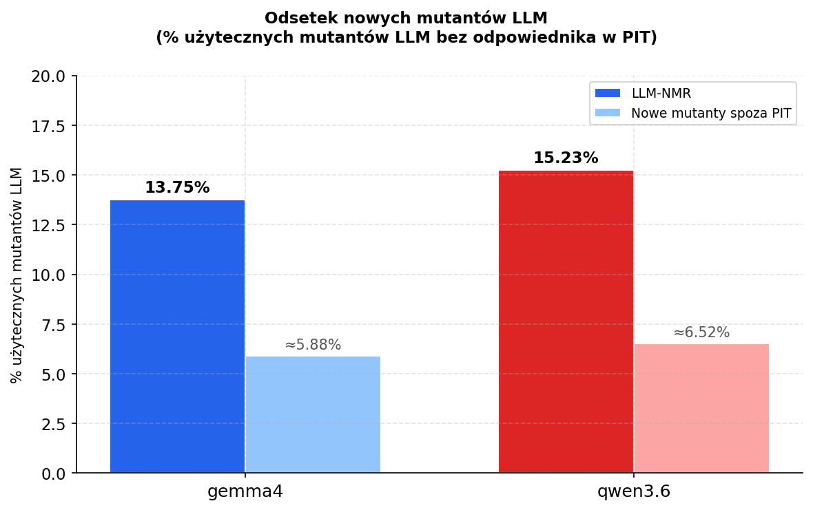
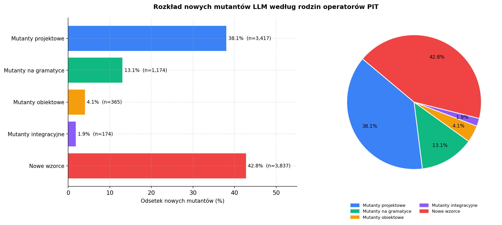
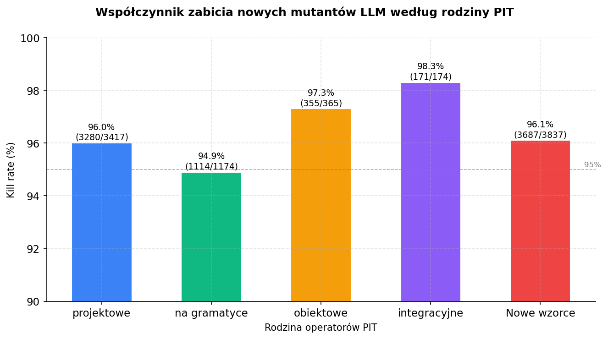
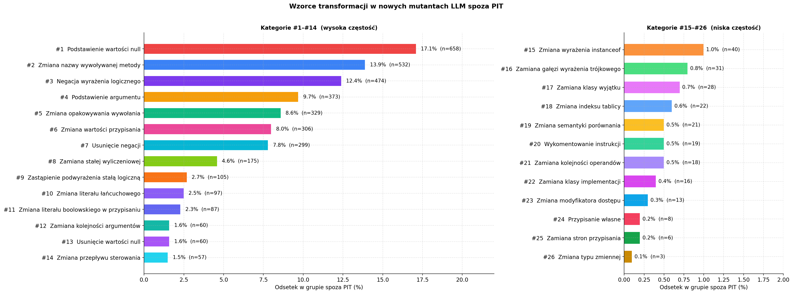
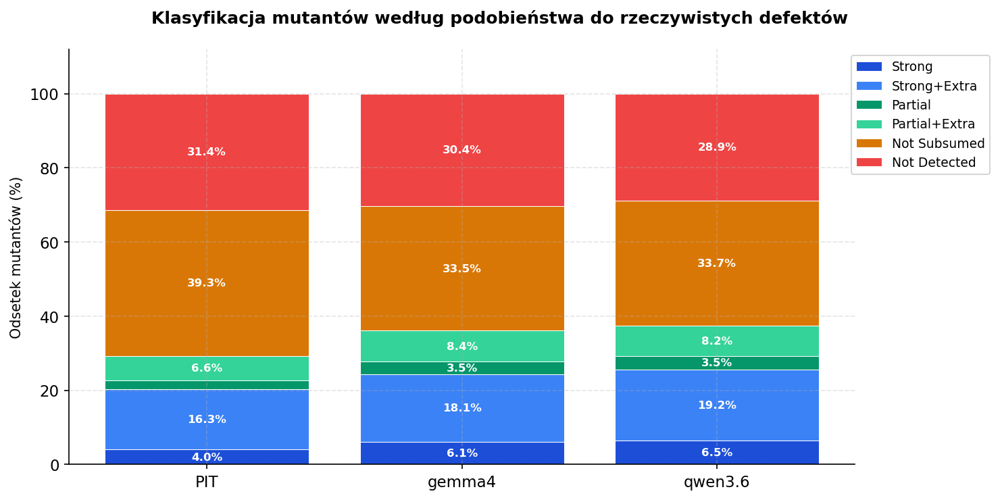

# LLM-Mutants: Analiza efektywności generowania operatorów mutacyjnych za pomocą dużych modeli językowych

**Kierunek**: Informatyka
**Specjalność**: Inżynieria Oprogramowania
**Numer albumu**: 1185432
**Autor**: Miraslau Douher
**Promotor:** dr. prof. Michał Mnich
**Uczelnia:** Uniwersytet Jagielloński
**Rok:** 2026

---

## Spis treści

- [Streszczenie](#streszczenie)

- [1 Wstęp](#rozdział-wstęp)
  - [1.1 Temat i cel pracy](#temat-i-cel-pracy)
  - [1.2 Budowa pracy](#budowa-pracy)

- [2 Testowanie mutacyjne](#testowanie-mutacyjne)
  - [2.1 Czym jest mutant?](#czym-jest-mutant)
  - [2.2 Zabicie mutanta i mutation score](#zabicie-mutanta-i-mutation-score)
  - [2.3 Proces testowania mutacyjnego krok po kroku](#proces-testowania-mutacyjnego-krok-po-kroku)
  - [2.4 Koszty i problemy praktyczne](#koszty-i-problemy-praktyczne)

- [3 Operatory mutacyjne w narzędziach klasycznych](#operatory-mutacyjne-w-narzędziach-klasycznych)
  - [3.1 Czym jest PIT](#czym-jest-pit)
  - [3.2 Katalog operatorów klasycznych](#katalog-operatorów-klasycznych)
    - [3.2.1 Mutanty projektowe](#mutanty-projektowe)
    - [3.2.2 Mutanty integracyjne](#mutanty-integracyjne)
    - [3.2.3 Mutanty obiektowe](#mutanty-obiektowe)
    - [3.2.4 Mutanty wykonywane na gramatyce](#mutanty-wykonywane-na-gramatyce)
  - [3.3 Ograniczenia operatorów klasycznych](#ograniczenia-operatorów-klasycznych)

- [4 LLM w testowaniu mutacyjnym](#llm-w-testowaniu-mutacyjnym)
  - [4.1 Czym są LLM?](#czym-są-llm)
  - [4.2 Zastosowania LLM jako generatora mutantów](#zastosowania-llm-jako-generatora-mutantów)
  - [4.3 Zalety i ograniczenia LLM w testowaniu mutacyjnym](#zalety-i-ograniczenia-llm-w-testowaniu-mutacyjnym)

- [5 Dane eksperymentalne i metryki](#dane-eksperymentalne-i-metryki)
  - [5.1 Zbiór rzeczywistych błędów](#zbiór-rzeczywistych-błędów)
  - [5.2 Rodzaje mutantów](#rodzaje-mutantów)
    - [5.2.1 Compilable mutants](#compilable-mutants)
    - [5.2.2 Duplicate mutants](#duplicate-mutants)
    - [5.2.3 Equivalent mutants](#equivalent-mutants)
  - [5.3 Metryki i kryteria oceny](#metryki-i-kryteria-oceny)
    - [5.3.1 LLM New Mutant Rate](#llm-new-mutant-rate)
    - [5.3.2 Real Bug Detection Rate](#real-bug-detection-rate)
    - [5.3.3 Average Ochiai Rate](#average-ochiai-rate)
    - [5.3.4 High Average Ochiai Rate](#high-average-ochiai-rate)
    - [5.3.5 High Ochiai Mutant Rate](#high-ochiai-mutant-rate)
    - [5.3.6 Coupling Rate](#coupling-rate)
    - [5.3.7 Average Mutant Generation Time](#average-mutant-generation-time)
    - [5.3.8 Cost per Useful Mutant](#cost-per-useful-mutant)
  - [5.4 Cel pracy i pytania badawcze](#cel-pracy-i-pytania-badawcze)

- [6 Założenia eksperymentu i metodyka](#założenia-eksperymentu-i-metodyka)
  - [6.1 Generacja mutantów](#generacja-mutantów)
  - [6.2 Przebieg eksperymentu](#przebieg-eksperymentu)

- [7 Analiza wyników i wnioski](#analiza-wyników-i-wnioski)
  - [7.1 Statystyki ogólne eksperymentu](#statystyki-ogólne-eksperymentu)
  - [7.2 RQ1 - Różnorodność i nowość mutantów LLM](#rq1---różnorodność-i-nowość-mutantów-llm)
  - [7.3 RQ2 - Podobieństwo mutantów do defektów rzeczywistych](#rq2---podobieństwo-mutantów-do-defektów-rzeczywistych)
  - [7.4 RQ3 - Koszty i wydajność podejścia](#rq3---koszty-i-wydajność-podejścia)

- [Podsumowanie i wnioski](#podsumowanie-i-wnioski)

- [Bibliografia](#bibliografia)
- [Repozytoria](#repozytoria)

## Streszczenie

Testowanie mutacyjne polega na wprowadzaniu drobnych, celowych zmian w kodzie, aby ocenić jakość testów.
Klasyczne narzędzia, takie jak PIT, polegają na stałym zestawie deterministycznych reguł dla generacji mutantów.
W tej pracy analizowano efektywność generacji mutantów przez LLM pod względem nowości, podobieństwa do rzeczywistych błędów oraz kosztów generacji.
Eksperyment przeprowadzono na 843 defektach, generując ponad 156 000 mutantów przy użyciu PIT oraz modeli gemma4 i qwen3.6.
Wyniki pokazują, że LLM potrafią wygenerować mutanty, które nie mają odpowiedników w PIT.
Mutanty LLM częściej odpowiadają rzeczywistym błędom i osiągają wyższe metryki jakości, choć ich generacja jest wolniejsza.
LLM stanowią wartościowe uzupełnienie klasycznych narzędzi, szczególnie w podejściu hybrydowym łączącym szybkość PIT z większym realizmem mutantów LLM.

---

## Rozdział Wstęp

### Temat i cel pracy

Rozwój dużych modeli językowych (ang. *Large Language Models*, LLM) oraz narzędzi opartych na tej technologii doprowadził do szerokiego stosowania automatycznego generowania kodu w produkcji oprogramowania.
Takie podejście pozwala przyspieszyć pracę inżynierów oprogramowania.
Wymaga jednak dokładniejszej weryfikacji dla osiągnięcia wystarczająco wysokiego poziomu pewności co do poprawności wygenerowanego kodu, co wciąż jest warunkiem koniecznym bezpiecznego wdrożenia.
Jedną z najlepszych metod oceny jakości testów jest stosowanie testowania mutacyjnego, polegające na wprowadzaniu drobnych zmian w kodzie i sprawdzaniu, czy istniejące testy potrafią je wykryć.
Klasyczne narzędzia mutacyjne dysponują jednak tylko niewielkim katalogiem operatorów, co ogranicza przestrzeń defektów rzeczywiście popełnianych przez programistów.

Z drugiej strony LLM, trenowane na większości dostępnych w internecie zbiorach kodu oraz historii bugów, mają szerszą wiedzę o defektach popełnianych w produkcyjnym oprogramowaniu.
Dzięki temu możliwe jest wykorzystanie LLM do generowania bardziej nieoczekiwanych oraz realistycznych mutantów.
Pozwala to wykraczać poza ograniczony zestaw reguł dostępnych w klasycznych narzędziach mutacyjnych, a tym samym zwiększać jakość testów.
Z kolei pozwala to wzmocnić poziom zaufania do oprogramowania, w tym do automatycznie wygenerowanego kodu.

Celem niniejszej pracy jest analiza efektywności generowania operatorów mutacyjnych przy użyciu LLM w porównaniu z operatorami klasycznymi.
W ramach badania zostaną przeanalizowane nowe operatory LLM, ich bliskość do rzeczywistych błędów oraz ich wydajność w porównaniu z operatorami klasycznymi.

### Budowa pracy

Wygląd zawartości rozdziałów przedstawionych w pracy:

- **Rozdział 1** Temat i cel pracy wraz z zawartością poszczególnych rozdziałów.
- **Rozdział 2** Definicja testowania mutacyjnego, mutation score, rodzaje mutantów oraz opis procesu testowania mutacyjnego.
- **Rozdział 3** Klasyczne operatory mutacyjne na przykładzie narzędzia PIT, zasada działania, katalog operatorów klasycznych z grupy ALL.
- **Rozdział 4** Duże modele językowe w inżynierii oprogramowania, testowaniu mutacyjnym, rola LLM jako generatora mutantów i zmian w kodzie oraz związane z tym ryzyka.
- **Rozdział 5** Rzeczywiste błędy ze zbioru Defects4J 3.0.1 miary podobieństwa mutantów do defektów wyznaczone na podstawie profili testowych oraz definicja wszystkich metryk i kryteriów oceny stosowanych w badaniu.
- **Rozdział 6** Metodyka eksperymentu: przebieg badania, generacja mutantów przez LLM i PIT, weryfikacja wyników oraz zbieranie danych do dalszej analizy metryk.
- **Rozdział 7** Analiza wyników eksperymentu, interpretacja danych liczbowych, odpowiedzi na tezy badawcze, porównanie LLM i PIT oraz ograniczenia badania.
- **Podsumowanie** Główne wnioski pracy.

## Testowanie mutacyjne

Testowanie mutacyjne to technika oceny tego, jak dobrze testy wykrywają defekty w kodzie.
Polega ona na celowym wprowadzaniu drobnych zmian w kodzie programu, a następnie na sprawdzaniu, czy testy są w stanie te zmiany wykryć.
Każda taka zmiana tworzy nową wersję kodu, zwaną mutantem, który jest następnie sprawdzany przez testy.
Dzięki temu można ocenić, jak dobrze testy sprawdzają logikę oraz wymagania programu i czy są w stanie wykryć potencjalne błędy w kodzie.

Ocena jakości testów automatycznych jest jednym z najważniejszych problemów inżynierii oprogramowania.
Najczęściej używanym sposobem oceny jest sprawdzenie tzw. pokrycia kodu (ang. *code coverage*), czyli tego, jaki procent kodu jest wykonywany podczas testów.
Jednak problem polega na tym, że nawet jeśli kod jest wykonywany, to niekoniecznie oznacza, że jest sprawdzany.
Test, który uruchamia metodę, ale nie sprawdza jej wyniku, może mieć 100% pokrycie kodu, ale nie dawać żadnej informacji o tym, czy program działa poprawnie i spełnia wymagania biznesowe.
Dlatego ważne jest sprawdzenie, czy testy są w stanie wykryć błąd, gdy taki się pojawi.

Najważniejsze pytanie, na które nie odpowiada pokrycie kodu: czy testy rzeczywiście są w stanie wykryć błąd w przypadku jego wystąpienia?
Odpowiedź na to pytanie daje testowanie mutacyjne.
Zamiast sprawdzać, jaki procent kodu jest wykonywany, testowanie mutacyjne sprawdza, czy testy są w stanie odróżnić poprawne zachowanie programu od błędnego.
Pozwala to ocenić nie tylko poprawność testu, ale również to, jak dobrze dany przypadek testowy został zdefiniowany.
Robi się to przez celowe wprowadzanie drobnych zmian w kodzie i sprawdzenie, czy testy te zmiany wykrywają.
Jeżeli zmiana nie zostanie wykryta, oznacza to, że testy nie są wystarczająco dobre.

Testowanie mutacyjne jest więc narzędziem, które pomaga ocenić, jak dobre są nasze testy, a nie tylko, jaki jest ich zasięg.
Jego użyteczność wynika z tego, że pyta o to, co się stanie, gdy w przypadku wystąpienia błędu, zamiast pytać, co zostało wykonane.
Aby móc przeprowadzić taką ocenę, trzeba najpierw zdefiniować, czym jest mutant i jak przebiega jego analiza.

### Czym jest mutant?

Mutant to specjalna wersja kodu, który powstaje przez wprowadzenie drobnej zmiany w oryginalnym kodzie.
Zmiana ta jest celowa i wynika z określonej reguły, która nazywa się operatorem mutacyjnym.
Definicja mutanta jest stosunkowo prosta, ale kryje w sobie kilka ważnych szczegółów.
- Po pierwsze, mutant różni się od oryginału tylko w jednym miejscu.
- Po drugie, zmiana jest celowa, a nie losowa. W klasycznym podejściu to określony operator mutacyjny.
- Po trzecie, mutant nie jest błędem, który występuje w systemie produkcyjnym, ale raczej sztuczną symulacją błędów, które mogą wystąpić w kodzie.
Z tego powodu symulacja ma być jak najbardziej podobna do prawdziwych błędów, żeby stosowanie testów mutacyjnych do oceniania jakości testów jednostkowych było efektywne.

Celem mutanta jest sprawdzenie, czy istniejące testy są w stanie wykryć błędy.
Typowe zmiany wprowadzane przez operatory mutacyjne to na przykład zamiana operatora `<` na `<=`, negacja warunku logicznego, usunięcie lub zastąpienia wywołania metody.
Każda z tych zmian symuluje inny rodzaj błędu i może pokazać słabość w zestawie testów.
Weryfikacja mutanta polega na uruchomieniu pełnego zestawu testów jednostkowych na zmutowanej wersji programu.
Jeśli co najmniej jeden test nie powiedzie się, mutant zostaje "zabity".
Jeśli wszystkie testy przejdą pomyślnie, mutant "przeżyje".
Przeżycie mutanta oznacza, że testy nie są wystarczająco dokładne w danym miejscu programu lub nawet niepoprawne.
Często jest to sygnałem, że testy nie sprawdzają odpowiednich wymagań kodu.
Wynik weryfikacji mutanta nie mówi nic o tym, czy kod jest poprawny, ale mówi, jak uważnie testy go obserwują.
Aby ocenić jakość testów, używa się metryki mutation score, która opisuje, jak mierzyć łączny wynik weryfikacji całego zbioru mutantów.

### Zabicie mutanta i mutation score

Gdy mutanty są wygenerowane, następuje ocena poprzez uruchomienie zbioru testów jednostkowych na zmodyfikowanym kodzie.
Na tym etapie sprawdzane jest, czy istniejące testy jednostkowe potrafią zidentyfikować, że w kodzie został wprowadzony defekt, który zmienia zachowanie programu.
Może to oznaczać, że mutant zawiera zarówno zmianę znaczącą, jak i prawie niewidoczną usterkę w kodzie.
Niezależnie od charakteru zmiany, jeżeli co najmniej jeden test zakończy się niepowodzeniem, oznacza to, że mutant został "zabity" (killed mutant).
Wskazuje to, że testy poprawnie reagują na modyfikacje w zachowaniu programu, które potencjalnie mogłyby być błędem w kodzie.

W innym przypadku, gdy testy jednostkowe nie wykryły zmian w kodzie, mutant jest klasyfikowany jako "przeżywający" (survived mutant).
Oznacza to, że testy niewystarczająco pokrywają kod albo nie sprawdzają odpowiednich wymagań, lub też zawierają błędy.
W każdym takim przypadku niewykrycie mutanta świadczy o słabości testów, co pozwala na estymację jakości zestawu testów oraz na wnioskowanie jakości kodu sprawdzanego przez te testy.

Dla liczbowej oceny efektywności zestawu testów w kontekście mutacyjnego testowania stosuje się metrykę mutation score.
Metryka ta pozwala określić, jaki procent mutantów, które udało się skompilować, został zabity przez zbiór testów jednostkowych.

```
mutation score = liczba zabitych mutantów / liczba skompilowanych mutantów
```

Dla jasności można rozważyć przykład. Jeżeli podczas testowania wygenerowano 100 mutantów.
Spośród nich 20 nie skompilowało się i zostało wykluczonych ze zbioru mutantów.
Na pozostałych 80 mutantach wykonano testy oraz 60 spośród nich zostało zabitych, a 20 przeżyło.
W tym przypadku mutation score = 60 / 80 = 75%.
Ten wynik oznacza, że zestaw testów wychwytuje 75% symulowanych błędów.
Na ogół wyższy mutation score sugeruje lepszą skuteczność testów w wykrywaniu potencjalnych bugów.
Z kolei niższa wartość sugeruje, że testy mogą wymagać poprawy, ponieważ nie wykrywają symulowanych błędów w kodzie.

Trzeba jednak pamiętać, że mutation score nie jest jednoznacznym miernikiem jakości testów jednostkowych.
Należy odczytywać tę metrykę wyłącznie w kontekście wygenerowanych mutantów, od których całkowicie zależą wyniki testowania mutacyjnego.
Na przykład duża liczba podobnych lub bardzo trywialnych mutantów może prowadzić do błędnych wniosków.
Do testów mutacyjnych trzeba podchodzić z ostrożnością, żeby poprawnie zinterpretować wyniki.

### Proces testowania mutacyjnego krok po kroku

Proces testowania mutacyjnego został po raz pierwszy opisany w 1978 roku przez DeMillo [5].
W praktyce cały proces składa się z kolejnych etapów, w których każdy następny krok jest uzależniony od wyniku etapu poprzedniego [2],[4].
Na początku generuje się tak zwany zbiór mutantów, po czym sprawdza się, czy są one poprawne pod względem technicznym, żeby można było uruchomić na nich testy.
Następnie przeprowadza się analizę wyników oraz interpretację danych, takich jak "mutation score" i inne ustalone metryki, w celu oceny jakości testów.


1. Na początku wybierany jest fragment kodu, który będzie analizowany. 
2. Generowany jest zbiór mutantów w celu symulowania potencjalnych błędów w kodzie.
3. Dla każdego wygenerowanego mutantu sprawdzana jest poprawność techniczna, najczęściej poprzez kompilację, tak aby do dalszego etapu trafiały jedynie mutanty możliwe do uruchomienia.
4. Dla mutantów, które przeszły ten etap, wykonywany jest zbiór testów w celu sprawdzenia, czy wprowadzona zmiana powoduje obserwowalną zmianę zachowania kodu.
5. Po zakończeniu testów mutant zostaje sklasyfikowany jako zabity, jeżeli co najmniej jeden test zakończy się niepowodzeniem, albo jako przeżywający, jeżeli cały zestaw testów przejdzie.
6. Kolejnym krokiem oblicza się mutation score, czyli procent zabitych mutantów, które przeszły etap sprawdzenia technicznego.
7. Na samym końcu przeprowadzana jest interpretacja wyników w celu oceny jakości testów, które wymagają poprawy/uzupełnienia testów.

### Koszty i problemy praktyczne

Największą przeszkodą w stosowaniu testowania mutacyjnego w praktyce jest wysoki koszt obliczeniowy oraz czasowy związany z generowaniem, kompilacją oraz uruchamianiem dużej liczby mutantów.
Każdy mutant wymaga osobnego sprawdzenia, dlatego łączny koszt analizy rośnie bardzo szybko.
Jeżeli projekt zawiera N testów oraz wygenerowano dla niego M mutantów, to liczba uruchomień rośnie w przybliżeniu proporcjonalnie do iloczynu N i M, co wprowadza znaczący narzut infrastrukturalny oraz czasowy.
Z tego powodu testowanie mutacyjne, mimo bardzo wartościowej informacji o jakości testów, jest w projektach produkcyjnych stosowane rzadko albo ograniczane tylko do najbardziej krytycznych modułów.

Jednym z podstawowych sposobów ograniczania tego kosztu jest zmniejszenie liczby analizowanych mutantów.
W literaturze [4] opisuje się mutant sampling (losowy wybór reprezentatywnego podzbioru mutantów) oraz selective mutation (ograniczenie analizy do operatorów uznawanych za najbardziej informatywne).
Takie podejście pozwala skrócić czas wykonania przy zachowaniu bardzo przybliżonej do oryginału oceny mutation score.
Dodatkowo współczesne narzędzia starają się przyspieszać analizę przez równoległość, ograniczanie liczby uruchamianych testów oraz mutację na poziomie bajtkodu JVM, co wykorzystuje między innymi PIT [1],[2].

Częściowym sposobem ograniczenia tego problemu może być także generowanie mutantów przy użyciu LLM.
W przeciwieństwie do klasycznych operatorów mutacyjnych, opartych na szerokim katalogu operatorów, LLM mogą potencjalnie generować mniejszą liczbę mutantów oraz bardziej zbliżonych do rzeczywistych błędów w kodzie.
W takim przypadku redukcja liczby kandydatów może obniżyć koszt dalszej kompilacji i uruchamiania testów.
Dodatkową zaletą jest to, że istnieją już małe, kwantyzowane LLM osiągające dobre wyniki w benchmarkach, dla których koszt obliczeniowy oraz czas pojedynczej generacji mogą być relatywnie niskie.
Oznacza to, że przy odpowiednio dobranym modelu i strategii selekcji mutantów podejście LLM może częściowo poprawić praktyczną opłacalność testowania mutacyjnego, zwiększając dostępność tego podejścia dla szerszego zakresu projektów produkcyjnych.

---

## Operatory mutacyjne w narzędziach klasycznych

Głównym celem operatorów mutacyjnych jest symulowanie typowych błędów w kodzie.
Klasyczne operatory mutacyjne to zbiór zdefiniowanych reguł transformacji kodu, których celem jest tworzenie sztucznych błędów o przewidywalnym charakterze.
Ich największą zaletą jest powtarzalność, ponieważ każdy operator opisuje jasno określony wzorzec zmiany, co pozwala na stosunkowo łatwą automatyzację oraz pełną kontrolę nad procesem generacji mutantów.
W tym rozdziale przedstawiono klasyczne operatory, realizowane za pomocą narzędzia PIT [1], jako rozpowszechnione i dobrze udokumentowane rozwiązanie.

### Czym jest PIT

PIT jest narzędziem do testowania mutacyjnego dla projektów napisanych w Javie.
W niniejszej pracy stanowi ono reprezentatywne źródło klasycznych operatorów mutacyjnych, ponieważ udostępnia zarówno publiczną dokumentację z definicjami operatorów, jak i otwarty kod źródłowy.
Pozwala to jednoznacznie określić, jakie mutanty są generowane, co będzie potrzebne w dalszej analizie.
W badaniu uwzględniono stabilne operatory dostępne w dokumentacji PIT bez operatorów eksperymentalnych, które w większości powtarzają stabilne operatory.

### Katalog operatorów klasycznych

W klasyfikacji operatorów mutacyjnych wykorzystano klasyfikację przedstawioną przez Ammanna i Offutta [4].
Na tej podstawie operatory PIT z grupy "ALL" uporządkowano według czterech rodzin, aby zdefiniować uporządkowaną listę klasycznych mutantów do porównania z mutantami wygenerowanymi przez LLM.

#### Mutanty projektowe

Mutanty projektowe stanowią zbiór modyfikacji kodu źródłowego, które symulują proste lokalne błędy w logice.
Obejmują one operacje arytmetyczne, inkrementacje, operatory relacyjne, operatory bitowe oraz literały występujące w obrębie jednej metody.

- `Conditionals Boundary` - służy do testowania poprawności warunków granicznych. Działa przez zamianę `<` na `<=`, `<=` na `<`, `>` na `>=` oraz `>=` na `>`.
- `Increments` - sprawdza poprawność aktualizacji zmiennych lokalnych. Działa przez zamianę inkrementacji na dekrementacje i odwrotnie.
- `Invert Negatives` - bada poprawność użycia znaku wartości numerycznych. Działa przez usunięcie negacji albo odwrócenie znaku zmiennej, ale nie mutuje ujemnych literałów.
- `Math` - odpowiada za mutacje operatorów arytmetycznych, bitowych i przesunięć. Obejmuje między innymi zamiany `+` na `-`, `*` na `/`, `%` na `*`, `&` na `|` oraz `<<` na `>>`.
- `Negate Conditionals` - służy do sprawdzania logiki porównań. Działa przez zamianę `==` na `!=`, `!=` na `==`, `<` na `>=`, `<=` na `>` oraz `>` na `<=`.
- `Inline Constant` - mutuje literały przypisane do zmiennych niefinalnych. W zależności od typu zmienia je na wartości graniczne albo zwiększa ich wartość.
- `Remove Increments` - usuwa inkrementację lokalnych zmiennych.

Mutanty projektowe są w katalogu PIT najliczniejsze.
Wynika to z faktu, że klasyczne testowanie mutacyjne historycznie skupiało się na drobnych błędach w obrębie pojedynczej jednostki kodu, takich jak błędna granica porównania albo niewłaściwa modyfikacja zmiennej lokalnej.

#### Mutanty integracyjne

Mutanty integracyjne stanowią zbiór modyfikacji kodu źródłowego, które badają poprawność współpracy między metodami oraz przepływu wartości pomiędzy komponentami kodu.

- `Void Method Call` - usuwa wywołania metod typu `void`. Pozwala to sprawdzić, czy testy wykrywają brak efektu ubocznego operacji, która nic nie zwraca.
- `Non Void Method Calls` - usuwa wywołania metod zwracających wartość oraz zastępuje ich wynik domyślną wartością Javy dla danego typu, na przykład `0`, `false`, `0.0` albo `null`.
- `Argument Propagation` - zastępuje całe wywołanie metody jednym z jego argumentów o zgodnym typie. Bada to pominięcie logiki metody i dalsze użycie wartości wejściowej.

Jeżeli usunięcie wywołania metody albo zastąpienie przekazywanych parametrów nie wpływa na wynik testów, może to oznaczać, że integracja między elementami programu nie jest wystarczająco dobrze przetestowana.

#### Mutanty obiektowe

Mutanty obiektowe stanowią zbiór modyfikacji kodu źródłowego, które symulują błędy związane z korzystaniem z mechanizmów obiektowych.

- `Constructor Calls` - zastępuje wywołanie konstruktora wartością `null`. Służy do badania odporności programu na brak poprawnie zainicjalizowanego obiektu.
- `Big Integer` - zamienia wywołania metod na obiektach `BigInteger`. Reprezentuje to błędy w użyciu obiektowego API liczbowego.
- `Big Decimal` - zamienia wywołania metod na obiektach `BigDecimal`. Reprezentuje to błędy w użyciu obiektowego API liczbowego dla liczb dziesiętnych.
- `Member Variable` - usuwa przypisania do pól obiektów, także pól finalnych, przez co pola przyjmują domyślne wartości Javy.
- `Naked Receiver` - zastępuje wywołanie metody samym odbiorcą wywołania, co oznacza pominięcie logiki tej metody przy zachowaniu obiektu.

Choć PIT nie implementuje całego katalogu klasycznych operatorów obiektowych znanych z literatury, zawiera wystarczająco reprezentatywną grupę związaną z programowaniem obiektowym.

#### Mutanty wykonywane na gramatyce

Mutanty wykonywane na gramatyce obejmują takie modyfikacje, które symulują błędy przepływu sterowania albo zwracania wyniku z metody.
W odróżnieniu od mutacji projektowych nie dotyczą one wyłącznie pojedynczego operatora, lecz wpływają na semantykę instrukcji `return`, `if` lub `switch`.

- `Empty Returns` - zastępuje wynik metody odpowiadającą mu pustą reprezentacją. W praktyce może to być pusty napis, pusta kolekcja, `Optional.empty()` albo wartość zero. Operator ten pozwala sprawdzić, czy testy odróżniają wynik rzeczywisty od poprawnego składniowo, ale semantycznie pustego.
- `False Returns` - wymusza zwracanie `false` dla wartości logicznych. Jest użyteczny tam, gdzie poprawność programu zależy od pojedynczych decyzji logicznych zwracanych przez metodę.
- `True Returns` - wymusza zwracanie `true` dla wartości logicznych. Jest analogiczny do `False Returns`.
- `Null Returns` - zastępuje zwracany obiekt wartością `null`. Operator ten pozwala sprawdzić, czy testy poprawnie sprawdzają brak oczekiwanego obiektu.
- `Primitive Returns` - zastępuje prymitywne wartości zwracane przez `0`. Dzięki temu bada, czy testy odróżniają wynik obliczenia od wartości domyślnej dla typu numerycznego.
- `Remove Conditional` - usuwa znaczenie warunku i wymusza wykonanie albo pominięcie gałęzi `if` lub `else`. Dokumentacja PIT wyróżnia tu specjalizacje dla warunków równościowych i porządkowych oraz dla gałęzi, która ma zostać wymuszona. Mutator ten sprawdza, czy testy są wrażliwe na sam wybór ścieżki wykonania programu.
- `Switch` - mutuje instrukcję `switch` przez zastąpienie etykiety domyślnej pierwszą etykietą jawną, a pozostałych etykiet wartością `default`.
- `Remove Switch` - usuwa wybrane etykiety `case` w `switch`, zamieniając z gałęzią domyślną.

Wspólną cechą tych mutantów jest to, że mutacje obejmują konstrukcje składniowe odpowiedzialne za wybór ścieżki wykonania albo za zwracanie wartości z metody.
Pozwala to badać, czy testy wykrywają błędy związane nie tylko z lokalnym operatorem, lecz również z błędną strukturą sterowania.

### Ograniczenia operatorów klasycznych

Mimo tego, że PIT ma bogaty katalog, nadal jest narzędziem opartym na skończonym zbiorze ręcznie zdefiniowanych reguł zaprojektowanych przez autorów narzędzia.
Każdy operator opisuje tylko taki rodzaj zmiany, jaki przewidzieli jego twórcy.
Dlatego przestrzeń możliwych defektów jest symulowana przez stosunkowo ograniczony obszar mutantów.
W praktyce oznacza to, że PIT nie tworzy zmian wyraźnie zależnych od znaczenia całego fragmentu programu, lecz od wzorca rozpoznanego przez konkretny mutator.
Jest to istotne, ponieważ właśnie poza tym obszarem mogą pojawiać się nowe operatory generowane przez LLM, które będą lepiej symulować rzeczywiste błędy w kodzie.
Ograniczona różnorodność transformacji w podejściu klasycznym stanowi więc jedną z głównych przyczyn dla badania LLM jako generatora mutantów.

---

## LLM w testowaniu mutacyjnym

Klasyczne operatory mutacyjne opierają się na skończonym, z góry zdefiniowanym zbiorze operatorów.
Z tego powodu zakres generowanych przez nie mutantów jest ograniczony do zmian realizowanych przez te operatory.
Z kolei LLM są znacznie większą klasą narzędzi, ponieważ generują kod na podstawie zależności statystycznych wyuczonych z dużych zbiorów danych.
W zastosowaniach związanych z testowaniem mutacyjnym [6] istotne są takie właściwości jak zdolność do uwzględniania kontekstu, możliwość generowania zmian podobnych do rzeczywistych błędów oraz syntaktycznie poprawnego kodu.
Właściwości te pozwalają traktować LLM jako narzędzie, które może efektywniej generować zmiany w kodzie odzwierciedlające rzeczywiste błędy.

### Czym są LLM?

Duże modele językowe (*Large Language Models*, LLM) są klasą modeli głębokiego uczenia trenowanych na ogromnych zbiorach danych.
Ich działanie jest oparte na modelowaniu zależności między elementami sekwencji oraz przewidywaniu najbardziej prawdopodobnego następnego tokenu na podstawie poprzedniego tekstu.
Współczesne LLM opierają się na architekturze transformera, co pozwala im uwzględniać relacje między odległymi elementami wejściowymi i przetwarzać długie fragmenty tekstu w spójny sposób.
W praktyce umożliwia to generowanie, uzupełnianie, streszczanie i przekształcanie treści, w tym również kodu, który traktowany jest jako strukturalny tekst, podlegający regułom syntaktycznym, zależnościom typów i wzorcom implementacyjnym.
W kontekście zastosowań mutacyjnych potrafią one generować zmiany, które są formalnie poprawne w danym miejscu w kodzie, a jednocześnie mogą prowadzić do innego zachowania programu.

### Zastosowania LLM jako generatora mutantów

W inżynierii oprogramowania LLM są wykorzystywane do analizy, generowania i modyfikacji kodu.
Obejmuje to uzupełnianie implementacji, wyjaśnianie działania istniejących fragmentów kodu, tworzenie dokumentacji, przygotowywanie testów oraz wspieranie przeglądu kodu.
Wspólną cechą tych zastosowań jest działanie na fragmentach kodu, których poprawność zależy nie tylko od pojedynczych elementów składniowych, ale również od relacji między instrukcjami, typami i przepływem sterowania.

Ta sama właściwość ma znaczenie w testowaniu mutacyjnym, gdzie istotne jest generowanie zmian możliwych do zastosowania w konkretnym miejscu programu, takich, aby mogły wpłynąć na jego zachowanie.
Z tego względu LLM mogą być rozpatrywane jako efektywne narzędzie do generowania mutantów w kodzie.
Model otrzymuje fragment programu oraz prompt opisujący oczekiwaną transformację.
Takie podejście umożliwia generowanie mutantów bez konieczności uprzedniego definiowania każdej reguły mutacyjnej w postaci osobnego operatora.
Zamiast tego model wykorzystuje kontekst, relacje między instrukcjami kodu oraz dane treningowe.

### Zalety i ograniczenia LLM w testowaniu mutacyjnym

Zastosowanie LLM w testowaniu mutacyjnym otwiera nowe możliwości do generowania mutantów, które nie są ograniczone do klasycznego katalogu operatorów.
Najważniejszą zaletą tego podejścia jest większa elastyczność tworzenia zmian, które są dostosowane do kontekstu programu.
Może to prowadzić do większej różnorodności analizowanych defektów oraz generowania mutantów bliższych rzeczywistym błędom.
Podejście to może być również przydatne, gdy celem jest wygenerowanie mniejszej liczby zmian, ale o większej wartości diagnostycznej.

Jednakże, ograniczenia tego podejścia wynikają z mniejszej przewidywalności samego procesu generacji w porównaniu do klasycznych operatorów.
Wygenerowane mutanty w dużym stopniu zależą od modelu, promptu i parametrów uruchomienia, a same zmiany mogą okazać się niekompilowane albo zduplikowane.
Pod tym względem wykorzystanie LLM w testowaniu mutacyjnym wymaga dodatkowej filtracji oraz walidacji.

---

## Dane eksperymentalne i metryki

Zanim przejdziemy do szczegółowego opisu eksperymentu, należy najpierw odpowiedzieć na pytanie, w jaki sposób ocenić, czy mutanty wygenerowane przez LLM są rzeczywiście lepsze od mutantów klasycznych.
Taka ocena wymaga zbioru rzeczywistych błędów, względem którego można analizować stopień realizmu mutantów, a także zastosowania odpowiednich metryk porównawczych.
W tym rozdziale zostanie przedstawiony zbiór defektów wykorzystany w badaniu, a potem zdefiniowane zostaną metryki służące do określania podobieństwa mutanta do rzeczywistego błędu.

### Zbiór rzeczywistych błędów

Oceniając jakość oprogramowania, kluczowa jest analiza zbioru udokumentowanych, rzeczywistych defektów, które faktycznie wystąpiły w kodzie produkcyjnym, zostały zgłoszone, a następnie naprawione przez programistów.
Zbiory te, znane jako repozytoria błędów, różnią się od standardowych zestawów testowych, ponieważ przechowują trzy kluczowe komponenty dla każdego błędu.
Po pierwsze, istnieje "wersja z błędami" kodu, która zawiera defekt w jego oryginalnym stanie, jeszcze przed naprawą.
Po drugie, mamy "wersję naprawioną" kodu, w której błąd został rozwiązany w sposób, który pozwala na porównanie zachowania programu przed i po naprawie.
Po trzecie, istnieją "testy jednostkowe", które kończą się niepowodzeniem po uruchomieniu wersji z błędami oraz kończą się powodzeniem w naprawionej wersji.
To ustrukturyzowane podejście pozwala na odtworzenie zachowania programu z obecnym błędem oraz porównanie jego z zachowaniem wygenerowanego mutanta.

Źródłem danych w tym badaniu jest **Defects4J** w wersji 3.0.1 [3]. 
Defects4J to zestaw 854 błędów z 17 projektów Java open-source, który jest utrzymywany przez naukowców od 2014 roku.
Dla każdego błędu mamy dostęp do wersji kodu z błędem oraz wersji naprawionej.
Co więcej, w celu ułatwienia analizy dostępna jest lista zmodyfikowanych klas, która pokazuje, które pliki zostały zmienione w wersji poprawionej.
Dostępny jest także zestaw nazw testów oraz możliwość automatycznego kompilowania i uruchamiania testów bez ręcznej konfiguracji środowiska.
Każdy błąd został zgłoszony w systemie śledzenia zgłoszeń, a następnie naprawiony w jednym zatwierdzeniu. 
Kod każdego błędu został ręcznie minimalizowany w taki sposób, żeby usunąć zmiany, które nie były związane z defektem, takie jak refaktoryzacja, czyli nowe funkcje.
Zgodnie z dokumentacją dla każdego błędu istnieje przynajmniej jeden test, który zawsze kończy się niepowodzeniem niezależnie od kolejności wywołania testów.

Tabela 5.1: Zbiór rzeczywistych defektów z Defects4J

| Identyfikator   | Projekt                | Liczba aktywnych bugów | IDs aktywnych bugów               |
|-----------------|------------------------|------------------------|-----------------------------------|
| Chart           | jfreechart             | 26                     | 1-26                              |
| Cli             | commons-cli            | 39                     | 1-5, 7-40                         |
| Closure         | closure-compiler       | 173                    | 1-62, 64-92, 94-120, 122-176      |
| Codec           | commons-codec          | 18                     | 1-18                              |
| Collections     | commons-collections    | 27                     | 1-9, 11-28                        |
| Compress        | commons-compress       | 47                     | 1-47                              |
| Csv             | commons-csv            | 16                     | 1-16                              |
| Gson            | gson                   | 18                     | 1-18                              |
| JacksonCore     | jackson-core           | 25                     | 1-16, 18-26                       |
| JacksonDatabind | jackson-databind       | 108                    | 1-25, 27-33, 35-64, 66-88, 90-112 |
| JacksonXml      | jackson-dataformat-xml | 6                      | 1-6                               |
| Jsoup           | jsoup                  | 90                     | 1-8, 10-16, 18-24, 26-93          |
| JxPath          | commons-jxpath         | 22                     | 1-22                              |
| Lang            | commons-lang           | 61                     | 1, 3-17, 19-24, 26-47, 49-65      |
| Math            | commons-math           | 104                    | 1-11, 13-103, 105-106             |
| Mockito         | mockito                | 37                     | 1-25, 27-38                       |
| Time            | joda-time              | 26                     | 1-20, 22-27                       |
| **Razem**       |                        | **843**                | -                                 |

Projekty obejmują różne rodzaje aplikacji, takie jak biblioteki pomocnicze (Lang, Math, Collections), parsery (Jsoup, Gson, JacksonCore, JacksonDatabind i Codec), kompilator (Closure) oraz narzędzia ogólnego przeznaczenia (Compress, Csv i Cli).
Taka różnorodność aplikacji pozwala uzyskać wyniki, które nie dotyczą tylko jednego rodzaju kodu, lecz mogą stanowić podstawę wniosków o szerszym zakresie.
W dalszej części rozdziału termin defekt oznacza pojedynczy rzeczywisty błąd pochodzący z tego zbioru.

### Rodzaje mutantów

Przeprowadzenie badania wymaga zdefiniowania zbiorów mutantów, na podstawie których będą liczone metryki wykorzystane w analizie tez badawczych.
Dla każdej metryki będzie wykorzystywany jeden z kolejnych zbiorów mutantów lub defektów:

- N_generated - liczba wszystkich wygenerowanych mutantów (zarówno LLM, jak i klasycznych).
- N_compilable - liczba mutantów, które można poprawnie skompilować.
- N_dup_compilable - liczba mutantów kompilowanych, które zostały oznaczone jako duplikaty syntaktyczne względem innego mutanta lub oryginału.
- N_useful - liczba "użytecznych" mutantów, czyli N_compilable - N_dup_compilable.
- N_killed - liczba mutantów zabitych przez co najmniej jeden test.
- N_survived - liczba mutantów przeżywających, czyli N_compilable - N_killed.
- N_coupled_mutants - liczba użytecznych mutantów, które są powiązane z profilem testowym odpowiadającego im defektu.
- N_high_ochiai_mutants - liczba użytecznych mutantów, dla których Ochiai przekracza przyjęty próg.
- N_new_mutants_LLM - liczba mutantów z tablicy LLM, które nie mają odpowiednika w tablicy mutantów klasycznych.

Wszystkie mutanty, dla których uruchomienie testów zakończyło się timeoutem, nie są zaliczane do zbioru ani do N_useful, ani do liczników N_killed/N_survived.

- T_gen_total - całkowity czas generacji mutantów ze zbioru N_generated.
- T_end2end_total - całkowity czas generacji oraz uruchomienia testów dla mutantów ze zbioru N_useful, potrzebny dla obliczenia metryk potrzebnych do analizy testów.

- N_defects - liczba wszystkich analizowanych defektów.
- N_detected_defects - liczba defektów, dla których co najmniej jeden użyteczny mutant powoduje nieprzechodzenie przynajmniej jednego testu z profilu tego defektu.
- N_ochiai_total - suma średnich wartości Ochiai wyznaczonych osobno dla każdego defektu na podstawie mutantów przypisanych do tego defektu.
- N_high_ochiai_defects - liczba defektów, dla których średni Ochiai przekracza przyjęty próg.

W dalszej części pracy termin "mutant" oznacza element ze zbioru użytecznych mutantów (N_useful), jeżeli nie napisano inaczej.

#### Compilable mutants

Mutant kompilowany to wersja kodu, która po wprowadzeniu mutacji przechodzi poprawnie etap kompilacji.
Oznacza to brak błędów strukturalnych, syntaktycznych, niezgodności typów oraz brakujących symboli, które uniemożliwiałyby uruchomienie testów na zmodyfikowanym kodzie.
W badaniu wszystkie wygenerowane mutanty, zarówno klasyczne, jak i wygenerowane przez LLM, są poddawane próbie kompilacji w konfiguracji projektu.
Mutanty niekompilowane nie będą uczestniczyć w metrykach opartych na uruchamianiu testów, ponieważ nie można uruchomić na nich testów.

Metryka jest zdefiniowana jako liczba mutantów, które można skompilować, podzielona przez całkowitą liczbę wygenerowanych mutantów.
```
Compilability Mutation Rate (CMR) = N_compilable / N_generated
```

Ta metryka będzie używana do obliczenia liczby mutantów możliwych do użycia w testowaniu, ponieważ LLM nie może gwarantować poprawnej generacji mutantów.
Będzie to potrzebne do oceniania stabilności generowania mutantów przez LLM, a także do porównania z klasycznymi mutantami, które charakteryzują się bardzo wysoką kompilowalnością 100% dla niektórych klasycznych narzędzi.

#### Duplicate mutants

Mutant zduplikowany to mutant, który syntaktycznie jest identyczny z innym mutantem albo z oryginalnym kodem.
Takie mutanty nie wprowadzają nowego zachowania i nie wnoszą nowych danych do analizy, ponieważ ich efekt został już uwzględniony.
Przed obliczaniem metryk usuwa się je ze zbioru, aby nie zawyżały wyników niektórych metryk.

Algorytm identyfikacji duplikatów polega na porównaniu reprezentacji kodu wygenerowanego mutanta po normalizacji z oryginalnym kodem oraz już istniejącymi mutantami.
Jeżeli dwie reprezentacje mutantów są identyczne względem siebie, oba mutanty traktowane są jako duplikaty tej samej modyfikacji.
Jeżeli mutant jest identyczny z oryginałem, oznacza się go jako duplikat.
Po ich usunięciu pozostaje zbiór mutantów unikalnych, który wraz z warunkiem kompilowalności stanowi podstawę do obliczania dalszych metryk.

```
Duplication Mutation Rate (DMR) = N_dup_compilable / N_compilable
```

Wskaźnik ten pokazuje, jaki odsetek mutantów kompilowanych stanowią duplikaty.

#### Equivalent mutants

Mutant ekwiwalentny to mutant, który mimo różnic syntaktycznych zachowuje się w taki sam sposób jak oryginalny kod.
Oznacza to, że żaden test nie jest w stanie wykryć wprowadzonej zmiany, ponieważ nie prowadzi ona do obserwowalnej różnicy w zachowaniu kodu.
Nie istnieje uniwersalny algorytm rozpoznawania mutantów ekwiwalentnych, ponieważ problem ten jest nierozstrzygalny w ogólnym przypadku, dlatego w analizie będą stosowane przybliżone metryki oparte na wynikach testów.
Za mutanty ekwiwalentne uznaje się mutanty kompilowane i niezduplikowane, które przeżywają cały dostępny zestaw testów.
Podejście daje wyniki przybliżone, bo mutanty mogą przeżywać testy z powodu ich niedostatecznego pokrycia, a nie faktycznej ekwiwalentności semantycznej.
Takie podejście nie daje dokładnych wyników, ale pozwala porównać efektywność generacji mutantów, co w naszym przypadku jest wystarczające.

```
Equivalent Mutation Rate (EMR) = N_survived / N_useful
```

### Metryki i kryteria oceny

Ocena mutantów opiera się na trzech najważniejszych kryteriach: stopniu różnorodności względem mutantów generowanych przez LLM oraz klasyczne narzędzia, poziomie podobieństwa do rzeczywistych błędów w kodzie, efektywności generacji mutantów, uwzględniając koszt oraz czas potrzebny do ich generacji.

W dalszej części rozdziału termin "mutant" oznacza mutanta kompilowanego i niezduplikowanego.

#### LLM New Mutant Rate

*LLM New Mutant Rate* (LLM-NMR) mierzy, jaka część mutantów generowanych przez LLM nie ma odpowiednika wśród mutantów klasycznych.
Wskaźnik pozwala ocenić, czy LLM generuje nowe typy mutantów nieobecne w katalogu klasycznych operatorów.

Mutant LLM liczy się za nowy, gdy spełnia jednocześnie:
1. Nie powtarza żadnej zmiany wprowadzonej przez klasycznego mutanta w tej samej linijce kodu (brak odpowiednika syntaktycznego po normalizacji).
2. Nie istnieje mutant klasyczny wywołujący ten sam zestaw nieprzechodzących testów (brak odpowiednika w profilu testowym).

```
LLM-NMR = N_new_mutants_LLM / N_useful(LLM)
```

Wysoka wartość wskaźnika oznacza, że LLM generuje dużo mutantów nieobecnych w katalogu klasycznym; niska, że generowane mutanty w znaczącej mierze pokrywają się z istniejącymi operatorami klasycznymi.

#### Real Bug Detection Rate

*Real Bug Detection Rate* (RBDR) mierzy, dla jakiej części rzeczywistych defektów można znaleźć co najmniej jednego mutanta, który wykazuje częściową zgodność profilu testowego z danym defektem.
Kluczowym elementem tej metryki jest porównanie dwóch zbiorów testów: profilu testowego mutanta oraz defektu.
Profil mutanta definiowany jako zbiór testów nieprzechodzących po wprowadzeniu mutacji, a profil defektu obejmuje testy, które nie przechodzą dla wersji kodu z bugiem, ale przechodzą dla naprawionej wersji.
Na przykład, jeśli profil defektu zawiera testy `T1` i `T2`, a istnieje mutant powodujący niepowodzenie testu `T1`, to taki rzeczywisty defekt jest uznawany za wykryty. 

```
RBDR = N_detected_defects / N_defects
```

Wysoka wartość RBDR oznacza, że dla wielu rzeczywistych defektów istnieją mutanty, które powodują niepowodzenie co najmniej części tych samych testów, co wskazuje na to, że odzwierciedlają one zachowanie rzeczywistych błędów.

#### Average Ochiai Rate

*Average Ochiai Rate* (AOR) mierzy, w jakim stopniu mutanty pokrywają się z profilami testowymi rzeczywistych defektów.
Kluczowym aspektem oceny jest porównanie dwóch zbiorów testów: profilu mutanta oraz profilu defektu.
W przeciwieństwie do `RBDR`, który jest metryką binarną, `AOR` odzwierciedla stopień tej zależności.
Im większa część testów wykrywających defekt znajduje się również w profilu mutanta, tym wyższa jest wartość tej metryki.

```
AOR = N_ochiai_total / N_defects
```

Wyższa wartość `AOR` oznacza, że profile niepowodzeń mutantów są bardziej zbliżone do profili testowych rzeczywistych defektów.

#### High Average Ochiai Rate

*High Average Ochiai Rate* (HAOR) mierzy, dla jakiej części defektów średnia wartość współczynnika Ochiai przekracza ustalony próg `0.8`.
Kluczowym aspektem tej metryki jest identyfikacja defektów, dla których większość mutantów wykazuje wysokie podobieństwo do rzeczywistych błędów, co oznacza, że zbiór mutantów dobrze odwzorowuje ich zachowanie.
W przeciwieństwie do AOR, który uśrednia wartości Ochiai dla wszystkich defektów, HAOR pokazuje odsetek defektów, które spełniają kryterium wysokiej zgodności.

```
HAOR = N_high_ochiai_defects / N_defects
```

Wyższa wartość `HAOR` oznacza, że dla większej części defektów wygenerowany zbiór mutantów jest bardzo podobny do rzeczywistych defektów.

#### High Ochiai Mutant Rate

*High Ochiai Mutant Rate* (HOMR) mierzy odsetek mutantów wartość współczynnika Ochiai, dla których ustalony próg przekracza `0.8`.
Kluczowym aspektem tej metryki jest identyfikacja mutantów, które indywidualnie wykazują wysoki stopień podobieństwa do rzeczywistych błędów.
W przeciwieństwie do AOR oraz HAOR, które analizują podobieństwo na poziomie defektów, HOMR pozwala określić, jaka część wygenerowanych mutantów reprezentuje rzeczywiste błędy, pomijając te mutanty, które nie odzwierciedlają zachowania rzeczywistych defektów.

```
HOMR = N_high_ochiai_mutants / N_useful
```

Wyższa wartość `HOMR` oznacza, że większa część wygenerowanych mutantów wykazuje wysokie podobieństwo do rzeczywistych błędów.

#### Coupling Rate

*Coupling Rate* (CR) mierzy, dla jakiej części użytecznych mutantów można znaleźć powiązanie z profilem testowym rzeczywistego defektu, dla którego dany mutant został wygenerowany.
Kluczowym elementem oceny jest porównanie dwóch zbiorów testów: profilu mutanta oraz profilu defektu.
Mutant jest powiązany z defektem, jeśli powoduje niepowodzenie co najmniej jednego testu z profilu tego defektu.

```
CR = N_coupled_mutants / N_useful
```

W odróżnieniu od `RBDR`, który ocenia pokrycie od strony defektów, `CR` pokazuje, jaka część mutantów jest rzeczywiście związana z zachowaniem błędów w programie.

#### Average Mutant Generation Time

*Average Mutant Generation Time* (AMGT) mierzy średni czas potrzebny do wygenerowania jednego mutanta.
Podstawą oceny jest łączny czas etapu generacji oraz całkowita liczba wygenerowanych mutantów.
Dla LLM czas ten obejmuje okres od wysłania zapytania do modelu do uzyskania pełnej odpowiedzi.

```
AMGT = T_gen_total / N_generated
```

Niższa wartość `AMGT` oznacza szybsze wytwarzanie pojedynczych mutantów i mniejszy koszt czasowy etapu generacji mutantów.

#### Cost per Useful Mutant

*Cost per Useful Mutant* (CPUM) mierzy koszt czasowy uzyskania jednego użytecznego mutanta, czyli mutanta kompilowanego i niezduplikowanego.

```
CPUM = T_end2end_total / N_useful
```

Niższa wartość `CPUM` oznacza, że dane podejście szybciej generuje mutanty przydatne do dalszego uruchomienia oraz analizy.

### Cel pracy i pytania badawcze

Celem tej pracy jest weryfikacja, czy LLM mogą generować nowe mutanty, których nie można uzyskać za pomocą klasycznych operatorów mutacyjnych.
Dodatkowo analizowane jest, czy te wygenerowane mutanty są bardziej zbliżone do rzeczywistych defektów w programie w porównaniu do generowanych przy użyciu klasycznych narzędzi, a także jakie są koszty i ograniczenia podejścia opartego na LLM.

Badanie odpowiada na trzy pytania badawcze:

RQ1 - Czy możliwe jest generowanie nowych mutantów przy użyciu LLM, wykraczających poza klasyczny katalog operatorów mutacyjnych?

Pytanie dotyczy różnorodności: czy LLM w ogóle mogą wykroczyć poza zdefiniowany katalog klasycznych operatorów mutacyjnych.
Odpowiada na nie metryka *LLM New Mutant Rate* (LLM-NMR), która mierzy procent mutantów LLM nieposiadających odpowiednika wśród mutantów klasycznych wygenerowanych dla tego samego defektu.
Wysoka wartość LLM-NMR oznacza, że LLM generuje nowe mutanty, niedostępne w katalogu klasycznym.

RQ2 - Czy mutanty LLM są bliższe rzeczywistym defektom niż mutanty klasyczne?

Pytanie dotyczy realizmu: czy mutanty LLM wywołują niepowodzenia testów podobne do tych, które wywołuje rzeczywisty błąd.
Odpowiadają na nie trzy metryki. *Real Bug Detection Rate* (RBDR) mierzy, dla jakiej części analizowanych defektów istnieje co najmniej jeden mutant mający zgodny profil z defektem.
*Average Ochiai Rate* (AOR) wyraża średni stopień podobieństwa między profilem testowym mutanta a profilem rzeczywistego defektu.
*Coupling Rate* (CR) mierzy, jaki odsetek wszystkich mutantów jest powiązany z profilem testowym odpowiadającego im defektu.
Łączna analiza RBDR, AOR i CR pozwala ocenić, które z podejść generuje mutanty lepiej symulujące rzeczywiste defekty programów.

RQ3 - Czy mutanty generowane przez LLM są bardziej wydajne od bliskich klasycznych odpowiedników?

Pytanie dotyczy efektywności: ile kosztuje uzyskanie mutanta do uruchamiania testów, jak duży jest odsetek mutantów, które zostały odrzucone podczas filtracji, oraz jaki jest koszt czasowy potrzebny na generowanie zestawu mutantów.
Odpowiedzi na te pytania dostarczają metryki: *Compilability Mutation Rate* (CMR), *Duplication Mutation Rate* (DMR) i *Equivalent Mutation Rate* (EMR).
Te metryki opisują kolejno odsetek mutantów, które przeszły kompilację, odsetek duplikatów syntaktycznych wśród mutantów kompilowanych oraz odsetek użytecznych mutantów, które nie zostały wykryte przez cały zestaw testów
Wskaźniki kosztowe, takie jak *Average Mutant Generation Time* (AMGT) i *Cost per Useful Mutant* (CPUM), mierzą odpowiednio średni czas generacji jednego mutanta oraz efektywny koszt uzyskania jednego użytecznego mutanta, uwzględniając straty na etapie filtracji.

Tabela 5.2: Definicja metryk

| Metryka                        | Skrót   | Co mierzy                                                                      | Powiązane RQ |
|--------------------------------|---------|--------------------------------------------------------------------------------|--------------|
| LLM New Mutant Rate            | LLM-NMR | Odsetek mutantów LLM bez odpowiednika wśród mutantów klasycznych               | RQ1          |
| Real Bug Detection Rate        | RBDR    | Odsetek defektów, dla których istnieje co najmniej jeden powiązany mutant      | RQ2          |
| Average Ochiai Rate            | AOR     | Średni stopień podobieństwa profili testowych mutanta i defektu                | RQ2          |
| High Average Ochiai Rate       | HAOR    | Odsetek defektów, dla których wartość średniej Ochiai przekracza ustalony próg | RQ2          |
| High Ochiai Mutant Rate        | HOMR    | Odsetek mutantów, dla których wartość Ochiai przekracza ustalony próg          | RQ2          |
| Coupling Rate                  | CR      | Odsetek mutantów powiązanych z profilem odpowiadającego im defektu             | RQ2          |
| Compilability Mutation Rate    | CMR     | Odsetek wygenerowanych mutantów, które przeszły kompilację                     | RQ3          |
| Duplication Mutation Rate      | DMR     | Odsetek duplikatów syntaktycznych wśród kompilowalnych mutantów                | RQ3          |
| Equivalent Mutation Rate       | EMR     | Odsetek mutantów przeżywających pełny zestaw testów                            | RQ3          |
| Average Mutant Generation Time | AMGT    | Średni czas wytworzenia jednego mutanta                                        | RQ3          |
| Cost per Useful Mutant         | CPUM    | Efektywny koszt uzyskania jednego użytecznego mutanta                          | RQ3          |

Pytania badawcze są wzajemnie uzupełniające: RQ1 bada różnorodność, RQ2 bada realizm, RQ3 bada efektywność procesu generacji.

---

## Założenia eksperymentu i metodyka

Celem tego eksperymentu jest porównanie efektywności mutantów wygenerowanych przez modele językowe z klasycznymi metodami generacji.
W związku z tym dla każdego analizowanego defektu [3] generowany jest zbiór mutantów, na których są uruchomione testy, które stanowią podstawę dla dalszych obliczeń i interpretacji metryk.
Podczas uruchamiania testów dla każdego mutanta są zbierane wyniki testów, czas potrzebny dla generacji, uruchomienia wraz z informacją o niepowodzeniu kompilacji, błędy wykonania kodu oraz duplikatach mutantów.
Zebrany zestaw danych pozwoli policzyć wszystkie zdefiniowane metryki oraz uwzględnić koszt, jakość, podobieństwo do rzeczywistych defektów oraz ocenić efektywność różnych podejść w analizie testów dla wytwarzania oprogramowania.

### Generacja mutantów

Pierwszym etapem eksperymentu jest generowanie mutantów klasycznych oraz mutantów LLM dla każdego defektu z listy aktywnych bugów zbioru Defects4J.
Na tym etapie identyfikowane są zmodyfikowane klasy dla naprawy defektu, a następnie fragmenty kodu tych klas bezpośrednio związane z poprawką.
W tym celu porównywane są wersje *buggy* i *fixed* za pomocą komendy diff wbudowane w Defects4J, co pozwala określić zmienione oraz dodane linie kodu.
Na podstawie wyznaczonej różnicy wyznaczany jest obszar generowania mutantów, ograniczony przez użyte w kodzie konstrukcje językowe.
Obejmuje on przede wszystkim metody i konstruktory klasy, których zakres pokrywa się z co najmniej jedną linią zmodyfikowaną w poprawionej wersji względem wersji błędnej.
Jeżeli sama modyfikacja nie znajduje się bezpośrednio wewnątrz ciała metody, uwzględniane są również odpowiednie bloki inicjalizacji statycznej lub instancyjnej.
Takie podejście pozwala ograniczyć obszar mutacji wyłącznie do fragmentów kodu o największym znaczeniu z punktu widzenia rzeczywistych błędów, co umożliwia analizowanie tylko kodu istotnego dla konkretnego defektu, a nie całej klasy.
Ponadto takie podejście zapewnia porównywalność między mutantami klasycznymi oraz mutantami generowanymi przez duże modele językowe, ponieważ obie metody działają na tym samym zbiorze danych wejściowych.

W podejściu klasycznym do generowania mutantów wykorzystywane jest narzędzie PIT z modyfikacją oryginalnego kodu źródłowego [7].
Rozszerzenie pozwala zapisać mutanta w tej samej formie, w jakiej zapisywane są mutanty generowane przez modele językowe.
Współdzielenie ujednoliconej struktury mutantów pozwala na porównanie generacji mutantów w identycznych warunkach, bez optymalizacji na poziomie bajtkodu dla konkretnego języka.
Ponadto PIT ma fundamentalne ograniczenie, ponieważ wykonuje testy tylko do momentu "zabicia" mutanta, co nie pozwala uzyskać pełnego profilu testowego dla każdego mutanta.
Aby obejść to ograniczenie, wykorzystana została zmodyfikowana wersja PIT, która zapisuje mutanty w odpowiednim formacie, umożliwiając późniejsze uruchomienie testów w izolowanym środowisku oraz zbierając metryki.
Generacja klasyczna przebiega w kilku krokach.
Najpierw przygotowywana jest wersja fixed oraz wersja buggy danego defektu, po czym wersja fixed jest kompilowana dla całego defektu.
Następnie wybrane jednostki wejściowe są grupowane według klasy i przekazywane do PIT.
Wygenerowane mutanty są zapisywane przez zmodyfikowany mechanizm raportowania w postaci zawierającej numer linii kodu, linię źródłową kodu przed zmianą oraz po zmianie, nazwę operatora jak w dokumentacji PIT [1].

W badaniu jako reprezentację podejścia LLM wykorzystywane są dwa skwantyzowane modele `gemma4-26b-A4` oraz `qwen3.6-35b-A3`, które będą uruchamiane na serwerze Ollama w formacie GGUF.
Model `gemma4-26b-A4` jest oparty na oficjalnych wagach Google w formacie BF16 z architekturą Mixture of Experts (MoE).
Posiada on 25,2 miliarda parametrów, z czego podczas przetwarzania tokenu aktywowanych jest tylko 3,8 miliarda.
Finalny rozmiar modelu z zastosowanej kwantyzacji Q6_K wynosi 23 GB.
Drugi model `qwen3.6-35b-A3` jest oparty na oficjalnych wagach BF16 od Alibaba oraz architekturze MoE.
W tym przypadku model ma 34,7 miliarda parametrów, a liczba aktywnych parametrów podczas generowania wynosi 3 miliardy.
Rozmiar modelu po zastosowaniu kwantyzacji Q6_K wynosi 29 GB.
Oba modele oferują długość kontekstu równą 131072 tokenów, co po normalizacji danych wejściowych gwarantuje przestrzeganie całego kontekstu dla generacji mutantów.
Jedną z kluczowych cech obu modeli jest architektura MoE, która aktywuje tylko część dostępnych parametrów podczas generowania, co pozwala na kilkukrotne obniżenie kosztów obliczeniowych w porównaniu do modeli aktywujących wszystkie parametry.

W podejściu opartym na LLM dla generacji mutantów każdy fragment kodu jest traktowany jako osobna jednostka wejściowa dla generacji mutantów.
Podejście to zostało zastosowane w celu normalizacji danych wejściowych i zachowania balansu między długością kontekstu a efektywnością przetwarzania danych wejściowych.
Dla każdej jednostki tworzony jest dynamiczny prompt zawierający kod źródłowy wraz z numerami linii, "few-shot" przykłady mutantów oraz instrukcja określająca format wyjściowy, w jakim mają być zwracane wyniki.
Po zakończeniu generacji wykonywane jest oznaczanie duplikatów, obejmujące zarówno mutanty powtarzające poprzednie wygenerowane zmiany lub odpowiadające oryginalnemu kodowi.
Oba modele są zaprojektowane do pracy na sprzęcie z co najmniej 36 GB pamięci, co pozwala uruchomić modele zarówno na lokalnej stacji roboczej, jak i na podstawowym sprzęcie dla AI, co jest istotne z punktu widzenia oceny kosztów generowania mutantów w zastosowaniu produkcyjnym.
Cała generacja odbywa się w izolowanym środowisku, które stanowi serwer oparty na MAC mini z układem M4 Pro, 14-rdzeniowym CPU, 20-rdzeniowym GPU oraz 48 GB zunifikowanej pamięci RAM współdzielonej przez CPU i GPU.
Architektura pamięci zunifikowanej umożliwia efektywne wykorzystanie dostępnych zasobów przez modele językowe.
W połączeniu z architekturą Apple Silicon rozwiązanie umożliwia wykorzystanie sprzętowej akceleracji obliczeń oraz zoptymalizowanych bibliotek wykorzystywanych przez narzędzie Ollama, co zapewnia stabilne środowisko.

### Przebieg eksperymentu

Eksperyment został zaplanowany w sposób powtarzalny, realizowany według tego samego algorytmu.
Najpierw dla każdego defektu badawczego generowane są zbiory mutantów: klasyczne mutanty oraz mutanty LLM dla każdego z analizowanych modeli.
Potem każdemu mutantowi jest przypisywany unikalny identyfikator, metadane oraz może zostać oznaczony jako duplikat, jeżeli jest identyczny z innym mutantem lub oryginałem.
Następnie każdy z mutantów przechodzi procedurę weryfikacji, żeby sprawdzić możliwości zastosowania mutacji w kodzie, a następnie podlega skompilacji.
Każde pojedyncze uruchomienie testów na mutancie dostarcza nie tylko informacji o tym, czy dany mutant został zabity albo przeżył, ale również zestaw metryk potrzebnych do dalszej analizy efektywności LLM w generowaniu mutantów.
Na przykład takie dane jak status zastosowania mutacji, wynik kompilacji, profil testowy oraz czas potrzebny na kompilację i uruchomienie testów.
Takie podejście pozwala na porównanie obu metod generowania mutantów w tych samych warunkach eksperymentalnych.
Po zakończeniu etapu generacji oraz uruchamiania testów wyniki są porządkowane według analizowanego defektu i typu mutanta.
W wyniku tego procesu powstaje uporządkowany zbiór danych, który zawiera wszystkie dane niezbędne do obliczenia zdefiniowanych metryk oraz analizy.

---

## Analiza wyników i wnioski

Wyniki badania przedstawiono w kontekście tez badawczych na podstawie zebranych danych o mutantach oraz profilów testowych dla rzeczywistych defektów.
W analizie porównano mutanty wygenerowane z użyciem klasycznego narzędzia PIT oraz mutanty wygenerowane przez modele LLM.
Dla wszystkich mutantów uruchomiono zestawy testowe, co pozwoliło na zebranie porównywalnych metryk.
Prezentacja wyników obejmuje ogólne statystyki eksperymentu, analizę odnoszącą się do poszczególnych tez badawczych oraz omówienie istotnych ograniczeń.

### Statystyki ogólne eksperymentu

Badanie przeprowadzono na wszystkich *843 defektach* ze zbioru Defects4J 3.0.1, obejmującego 17 projektów w różnych domenach.
Łącznie wygenerowano *159970 mutantów*.

Tabela 7.1: Ogólne metryki jakościowe mutantów

| Metryka                        | PIT     | Gemma4-26b-A4 | Qwen3.6-35b-A3 |
|--------------------------------|---------|---------------|----------------|
| Number of Mutants              | 76 648  | 40 426        | 39 410         |
| Compilability Mutation Rate    | 100,00% | 88,00%        | 88,15%         |
| Duplication Mutation Rate      | 0,00%   | 7,24%         | 10,11%         |
| Equivalent Mutation Rate       | 31,43%  | 30,40%        | 28,94%         |
| LLM New Mutant Rate            | NA      | 13,75%        | 15,23%         |
| Real Bug Detection Rate        | 98,70%  | 97,98%        | 98,34%         |
| Average Ochiai Rate            | 22,66%  | 23,57%        | 24,37%         |
| Coupling Rate                  | 29,28%  | 36,10%        | 37,35%         |
| High Average Ochiai Rate       | 2,14%   | 2,14%         | 3,08%          |
| High Ochiai Mutant Rate        | 4,51%   | 6,94%         | 7,45%          |
| Average Mutant Generation Time | 0,047s  | 1,280s        | 2,422s         |
| Cost per Useful Mutant         | 22,44s  | 30,15s        | 29,68s         |

### RQ1 - Różnorodność i nowość mutantów LLM

Czy możliwe jest generowanie nowych mutantów przy użyciu LLM, wykraczających poza klasyczny katalog operatorów mutacyjnych?

Metryka LLM-NMR mierzy, jaki odsetek użytecznych mutantów LLM nie ma odpowiednika wśród mutantów PIT ani pod względem syntaktycznym, ani pod względem profilu testów.
Liczone są wyłącznie mutanty na liniach kodu, gdzie PIT również wygenerował co najmniej jednego mutanta.

| Model          | Porównywalne użyteczne mutanty | Nowe mutanty | LLM-NMR    |
|----------------|--------------------------------|--------------|------------|
| Gemma4-26b-A4  | 32 015                         | 4 402        | **13,75%** |
| Qwen3.6-35b-A3 | 29 974                         | 4 565        | **15,23%** |
| Łącznie        |                                | **8 967**    |            |

Oznacza to, że 13,75% użytecznych mutantów modelu Gemma4-26b-A4 i 15,23% modelu Qwen3.6-35b-A3 nie ma odpowiedników wśród mutantów PIT (ani syntaktycznie, ani pod względem profilu testów).
Brak odpowiednika oznacza, że PIT nie wygenerował mutanta w danej linii kodu, a nie że jego operatorzy nie potrafią wygenerować takiego rodzaju transformacji.
Spośród nowych mutantów część wykorzystuje znane operatory PIT, a tylko część reprezentuje transformacje, których PIT nie potrafi wygenerować.



Rysunek 7.1: LLM-NMR dla gemma4 i qwen3.6 oraz procent mutantów spoza PIT wśród użytecznych mutantów LLM.

#### Klasyfikacja nowych mutantów według rodzin PIT

Spośród nowych mutantów przeprowadzono klasyfikację według czterech rodzin operatorów klasycznych z rozdziału 3.
Wynik pokazuje, jaka część mutantów korzysta ze znanych transformacji operatorom PIT, ale zastosowanych w miejscu pominiętym przez PIT, a jaka generuje wzorce spoza zdefiniowanych operatorów PIT.

Tabela 7.2: Nowe mutanty LLM według rodzin operatorów PIT

| Rodzina mutantów PIT | gemma4    | qwen3.6   | Łącznie   | Udział    | Współczynnik zabicia mutantów |
|----------------------|-----------|-----------|-----------|-----------|-------------------------------|
| Mutanty projektowe   | 1 658     | 1 759     | 3 417     | 38,1%     | 96,0%                         |
| Mutanty na gramatyce | 582       | 592       | 1 174     | 13,1%     | 94,9%                         |
| Mutanty obiektowe    | 180       | 185       | 365       | 4,1%      | 97,3%                         |
| Mutanty integracyjne | 99        | 75        | 174       | 1,9%      | 98,3%                         |
| **Nowe wzorce**      | **1 883** | **1 954** | **3 837** | **42,8%** | **96,1%**                     |
| **Łącznie**          | **4 402** | **4 565** | **8 967** | **100%**  |                               |

Wynik ujawnia, że spośród 8 967 nowych mutantów 57,2% (5 130) należy do rodzin transformacji PIT, ale w kontekstach lub lokalizacjach kodu, których deterministyczne reguły PIT nie uwzględniły.
Dopiero reszta mutantów 42,8% (3 837) implementuje wzorce, których PIT nie posiada w żadnej ze swoich grup operatorów.



Rysunek 7.2: Rozkład nowych mutantów LLM według rodzin operatorów PIT



Rysunek 7.3: Współczynnik zabicia nowych mutantów LLM według rodziny operatorów

#### Wzorce mutacyjne spoza PIT

Łącznie 3 837 nowych mutantów LLM (42,8%) nie odpowiada żadnemu operatorowi PIT.
Poniżej przedstawiono podział tych wzorców wraz z uzasadnieniem, dlaczego PIT ich nie obejmuje.

Tabela 7.3: Wzorce mutacyjne spoza PIT

| Kategoria                            | Liczba | Udział | Dlaczego jest nowa                                                                                   |
|--------------------------------------|--------|--------|------------------------------------------------------------------------------------------------------|
| Podstawienie wartości null           | 658    | 17,1%  | PIT nie zastępuje null w argumentu wywołania                                                         |
| Zmiana nazwy wywoływanej metody      | 532    | 13,9%  | PIT nie zastępuje nazwy jednej metody inną                                                           |
| Negacja wyrażenia logicznego         | 474    | 12,4%  | PIT nie neguje zmiennych boolowskich ani wyników wywołań metod                                       |
| Podstawienie argumentu               | 373    | 9,7%   | PIT nie modyfikuje wartości poszczególnych argumentów wywołania                                      |
| Zmiana opakowywania wywołania        | 329    | 8,6%   | PIT może usunąć wywołanie, ale nie dodaje ani nie usuwa wrapperów wokół argumentów                   |
| Zmiana wartości przypisania          | 306    | 8,0%   | PIT nie zastępuje złożonego wyrażenia po prawej stronie przypisania                                  |
| Usunięcie negacji                    | 299    | 7,8%   | PIT nie usuwa istniejącej negacji z wyrażenia warunkowego                                            |
| Zamiana stałej wyliczeniowej         | 175    | 4,6%   | PIT działa tylko na literałach numerycznych; nie obejmuje stałych symbolicznych i enum               |
| Zastąpienie wyrażenia stałą logiczną | 105    | 2,7%   | PIT nie zastępuje pod-wyrażenia wewnątrz złożonego warunku                                           |
| Zmiana literału łańcuchowego         | 97     | 2,5%   | PIT nie obejmuje literałów tekstowych                                                                |
| Zmiana literału boolowskiego         | 87     | 2,3%   | PIT działa tylko na instrukcjach return, nie na przypisaniach                                        |
| Zamiana kolejności argumentów        | 60     | 1,6%   | PIT nie dokonuje permutacji argumentów wywołania                                                     |
| Usunięcie wartości null              | 60     | 1,6%   | PIT nie zastępuje wartości null wyrażeniem kontekstowym                                              |
| Zmiana przepływu sterowania          | 57     | 1,5%   | PIT nie zmienia słów kluczowych break/continue; nie zamienia while na if                             |
| Zmiana wyrażenia instanceof          | 40     | 1,0%   | PIT nie obejmuje wyrażeń instanceof; brak operatora zmieniającego typ w instanceof                   |
| Zamiana gałęzi wyrażenia trójkowego  | 31     | 0,8%   | PIT nie zamienia miejscami gałęzi true/false wyrażenia trójkowego                                    |
| Zamiana klasy wyjątku                | 28     | 0,7%   | PIT nie zastępuje klasy wyjątku inną klasą wyjątku                                                   |
| Zmiana indeksu tablicy               | 22     | 0,6%   | PIT nie zamienia indeksów tablicy                                                                    |
| Zmiana semantyki porównania          | 21     | 0,5%   | PIT nie zamienia .equals() na == lub odwracającego argumenty equals()                                |
| Wykomentowanie instrukcji            | 19     | 0,5%   | PIT nie komentuje instrukcji - usuwa lub zastępuje; wstawienie `//` jest nowym operatorem            |
| Zamiana kolejności operandów         | 18     | 0,5%   | PIT Math zmienia operator arytmetyczny, nie kolejność operandów (a − b -> b − a)                     |
| Zamiana klasy implementacji          | 16     | 0,4%   | PIT nie zamienia konkretną klasę implementacji (np. LinkedHashMap -> LinkedHashMap bez args)         |
| Zmiana modyfikatora                  | 13     | 0,3%   | PIT nie modyfikuje słów kluczowych dostępu ani modyfikatorów pól (private -> public, final usunięty) |
| Przypisanie własne                   | 8      | 0,2%   | PIT nie zastępuje wyrażeń przypisaniem samej zmiennej (x = method(x) -> x = x)                       |
| Zamiana stron przypisania            | 6      | 0,2%   | PIT nie zamienia miejscami lewej i prawej strony przypisania (x = y -> y = x)                        |
| Zmiana typu zmiennej                 | 3      | 0,1%   | PIT nie zmienia deklarowanego typu zmiennej (boolean -> Boolean)                                     |

**1. Podstawienie wartości null** (17,1%, n = 658)

LLM zastępuje jeden z argumentów wywołania metody wartością `null`.
Taki mutant sprawdza, czy kod poprawnie obsługuje brak wartości przy przekazaniu argumentu.
PIT może zwrócić `null` w wyniku wywołania metody, ale nie zastępuje argumentu wywołania wartością `null`.

```java
// PRE  (CLI_1)
Option key = resolveOption(opt);
// POST
Option key = resolveOption(null);
```

```java
// PRE  (CLI_13)
commandLine.addValue(option, token);
// POST
commandLine.addValue(null, token);
```

**2. Zmiana nazwy wywoływanej metody** (13,9%, n = 532)

LLM zastępuje nazwę metody inną nazwą, zachowując obiekt i argumenty wywołania.
Dotyczy zarówno prostych wywołań, jak i metod w złożonych wyrażeniach.
PIT może usunąć wywołanie lub zastąpić całe wywołanie argumentem, ale nie może użyć innej metody.

```java
// PRE  (CHART_1)
int seriesCount = dataset.getRowCount();
// POST
int seriesCount = dataset.getColumnCount();
```

```java
// PRE  (CLI_1)
if (opt.equals(option.getOpt()))
// POST
if (opt.contains(option.getOpt()))
```

**3. Negacja wyrażenia logicznego** (12,4%, n = 474)

LLM dodaje `!` przed zmienną logiczną lub wywołaniem metody zwracającej wartość logiczną.
PIT działa wyłącznie na operatorach relacyjnych (`==`, `<`, `>`) albo na wartościach liczbowych, nie może negować zmiennych boolowskich ani wyników wywołań metod.

```java
// PRE  (CLI_11)
if (option.hasArg() && option.hasArgName())
// POST
if (option.hasArg() && !option.hasArgName())
```

```java
// PRE  (CLOSURE_4)
boolean resolved = resolveViaRegistry(t, enclosing);
// POST
boolean resolved = !resolveViaRegistry(t, enclosing);
```

**4. Podstawienie argumentu** (9,7%, n = 373)

LLM zastępuje wartość jednego argumentu wewnątrz wywołania inną wartością, przy zachowaniu nazwy metody i pozostałych argumentów.
PIT zastępuje całe wywołanie jednym argumentów, ale nie może modyfikować poszczególnych argumentów.

```java
// PRE  (CHART_2)
double lower = getLowerBound(series, item);
// POST
double lower = getLowerBound(series, 0);
```

**5. Zmiana opakowywania wywołania** (8,6%, n = 329)

LLM usuwa lub dodaje wywołanie metody-wrappera wokół argumentu.
PIT może usunąć całe wywołanie metody, ale nie zmienia struktury zagnieżdżenia się argumentów.

```java
// PRE  (CLI_8)
sb.append(rtrim(text));
// POST
sb.append(text);
```

```java
// PRE  (CLI_8)
sb.append(rtrim(text.substring(0, pos))).append(defaultNewLine);
// POST
sb.append(text.substring(0, pos)).append(defaultNewLine);
```

Taki mutant symuluje pominięcie normalizacji parametrów wejściowych, np. wywołanie `rtrim()` usuwa białe znaki na końcu.

**6. Zmiana wartości przypisania** (8,0%, n = 306)

LLM zastępuje złożone wyrażenie po prawej stronie przypisania innym wyrażeniem kontekstowym.
Żaden operator PIT nie produkuje tego wzorca dla złożonych wyrażeń.

```java
// PRE  (CLI_15)
final Set triggers = option.getTriggers();
// POST
final Set triggers = new HashSet();
```

**7. Usunięcie negacji** (7,8%, n = 299)

LLM usuwa `!` z wyrażenia warunkowego, wzorzec odwrotny do negacji.
PIT zmienia operatory relacyjne, ale nie usuwa istniejącego `!`.

```java
// PRE  (CLI_20)
if (!options.hasOption(opt) && stopAtNonOption)
// POST
if (options.hasOption(opt) && stopAtNonOption)
```

```java
// PRE  (CLI_22)
if (stopAtNonOption && (currentOption == null || !currentOption.hasArg()))
// POST
if (stopAtNonOption && (currentOption == null || currentOption.hasArg()))
```

Taki mutant sprawdza, czy testy pokrywają pod-wyrażenia złożonego warunku niezależnie.

**8. Zamiana stałej wyliczeniowej** (4,6%, n = 175)

LLM zamienia jedną stałą wartość na inną z tej samej klasy.
PIT modyfikuje wyłącznie literały numeryczne (`int`, `long`, `float`, `double`), ale nie obejmuje stałych symbolicznych ani wartości enum.

```java
// PRE  (CHART_2)
double minimum = Double.POSITIVE_INFINITY;
// POST
double minimum = Double.NEGATIVE_INFINITY;
```

```java
// PRE  (CHART_12)
this.dataExtractOrder = TableOrder.BY_COLUMN;
// POST
this.dataExtractOrder = TableOrder.BY_ROW;
```

**9. Zastąpienie wyrażenia stałą logiczną** (2,7%, n = 105)

LLM zastępuje pod-wyrażenie złożonego warunku wartością `true` lub `false`.
PIT zastępuje cały warunek instrukcji `if`, a nie jego część, np. `if (a && b)` -> `if (true)` to całkowite usunięcie warunku.
Tutaj tylko jedno z wyrażeń złożonych zostaje zastąpione stałą.

```java
// PRE  (CLI_22)
if (stopAtNonOption && (currentOption == null || !currentOption.hasArg()))
// POST
if (true && (currentOption == null || !currentOption.hasArg()))
```

```java
// PRE  (CLOSURE_6)
if (ownerFn.isInterface() && ...)
// POST
if (true && ...)
```

**10. Zmiana literału łańcuchowego** (2,5%, n = 97)

LLM zmienia wartość literału tekstowego wewnątrz wyrażenia.
PIT obsługuje tylko typy numeryczne, może zwrócić pusty łańcuch jako wynik metody, ale nie zmienia literałów w kodzie.

```java
// PRE  (CLI_30)
|| "true".equalsIgnoreCase(value)
// POST
|| "false".equalsIgnoreCase(value)
```

```java
// PRE  (CLOSURE_9)
filename = filename.replace("\\", "/");
// POST
filename = filename.replace("/", "\\");
```

**11. Zmiana literału boolowskiego w przypisaniu** (2,3%, n = 87)

LLM zamienia `false` na `true` w instrukcji przypisania.
PIT działa tylko na `return`, albo wyklucza wartości logiczne w *Inline Constant*.

```java
// PRE  (CLI_31)
required = false;
// POST
required = true;
```

**12. Zamiana kolejności argumentów** (1,6%, n = 60)

LLM przestawia kolejność argumentów w wywołaniu metody.
PIT nie dokonuje permutacji argumentów.

```java
// PRE  (CHART_1)
LegendItem item = getLegendItem(index, i);
// POST
LegendItem item = getLegendItem(i, index);
```

**13. Usunięcie wartości null** (1,6%, n = 60)

LLM zastępuje wartość `null` wyrażeniem kontekstowym.
PIT może ustawiać wyniki na null, ale nie odwrotnie.

```java
// PRE  (CLI_21)
checkForOption = null;
// POST
checkForOption = trigger;
```

**14. Zmiana przepływu sterowania** (1,5%, n = 57)

LLM zmienia słowo kluczowe sterujące przepływem: `break` -> `continue`, `else if` -> `if`, lub komentuje instrukcję.
Żaden operator PIT nie modyfikuje słów kluczowych pętli ani struktury warunkowej.

```java
// PRE  (CLI_2)
break;
// POST
continue;
```

```java
// PRE  (CLI_5)
else if (str.startsWith("-"))
// POST
if (str.startsWith("-"))
```

**15. Zmiana wyrażenia instanceof** (1,0%, n = 40)

LLM zmienia typ lub neguje wyrażenie `instanceof`.
PIT nie obejmuje wyrażeń sprawdzania typu.

```java
// PRE  (CHART_2)
if (includeInterval && dataset instanceof IntervalXYDataset) {
// POST
if (includeInterval && !(dataset instanceof IntervalXYDataset)) {
```

**16. Zamiana gałęzi wyrażenia trójkowego** (0,8%, n = 31)

LLM zamienia miejscami gałęzie `true` i `false` wyrażenia (`? a : b` -> `? b : a`).

```java
// PRE  (JACKSONCORE_2)
_inputPtr = negative ? (startPtr + 1) : startPtr;
// POST
_inputPtr = negative ? startPtr : (startPtr + 1);
```

**17. Zamiana klasy wyjątku** (0,7%, n = 28)

LLM zastępuje klasę rzucanego wyjątku inną klasą.
PIT nie posiada operatora modyfikującego typ wyjątku.

```java
// PRE  (COMPRESS_5)
throw new IOException("The stream is closed");
// POST
throw new RuntimeException("The stream is closed");
```

**18. Zmiana indeksu tablicy** (0,6%, n = 22)

LLM zastępuje jeden indeks tablicy innym.

```java
// PRE  (JACKSONCORE_1)
return _inputBuffer[_inputPtr];
// POST
return _inputBuffer[_inputPtr + 1];
```

**19. Zmiana semantyki porównania** (0,5%, n = 21)

LLM zamienia metodę porównującą na inną o odmiennej semantyce: `.equals()` ↔ `==`, `.equals()` ↔ `.contains()`.
Zamiana `.equals()` na `==` symuluje mylenie równości wartościowej z referencyjną w Javie.

```java
// PRE  (CLI_1)
if (opt.equals(option.getOpt()))
// POST
if (opt.contains(option.getOpt()))
```

**20. Wykomentowanie instrukcji** (0,5%, n = 19)

LLM komentuje istniejącą instrukcję zamiast np. `break;` -> `// break;` lub `@Override` -> `// @Override`.
PIT usuwa lub zastępuje kod, ale nigdy nie stosuje komentarzy jako operatora mutacyjnego.

```java
// PRE  (CLI_2)
break;
// POST
// break;
```

**21. Zamiana kolejności operandów** (0,5%, n = 18)

LLM odwraca kolejność operandów w wyrażeniu arytmetycznym: `a - b` -> `b - a`, `rhs / entry` -> `entry / rhs`.
PIT zmienia symbol operatora arytmetycznego (np. `+` na `-`), ale nie zamienia miejscami operandów.

```java
// PRE  (TIME_19)
int diff = offsetPrev - offsetLocal;
// POST
int diff = offsetLocal - offsetPrev;
```

**22. Zamiana klasy implementacji** (0,4%, n = 16)

LLM zastępuje konkretną klasę implementacji interfejsu inną klasą implementującą ten sam interfejs.
PIT nie zamienia klas implementacji.

```java
// PRE  (CLI_7)
StringBuffer buff = new StringBuffer("Missing required option");
// POST
StringBuilder buff = new StringBuilder("Missing required option");
```

**23. Zmiana modyfikatora** (0,3%, n = 13)

LLM zmienia modyfikatory dostępu przy deklaracjach pól i klas: `private` -> `public`, usuwa `final`.
PIT nie dotyka nagłówków deklaracji.

```java
// PRE  (CSV_16)
private CSVRecord current;
// POST
public CSVRecord current;
```

**24. Przypisanie własne** (0,2%, n = 8)

LLM zastępuje wyrażenie przypisaniem samej zmiennej lewej strony (`x = method(x)` -> `x = x`), omijając obliczenie.
PIT nie produkuje tego wzorca.

```java
// PRE  (CHART_2)
minimum = Math.min(minimum, lvalue);
// POST
minimum = minimum;
```

```java
// PRE  (MOCKITO_23)
abstract class SerializableAnswer implements Answer<Object>, Serializable {
// POST
abstract class SerializableAnswer implements Answer<Object> {
```

**25. Zamiana stron przypisania** (0,2%, n = 6)

LLM zamienia miejscami lewą i prawą stronę przypisania: `x = y` -> `y = x`.

```java
// PRE  (CLOSURE_103)
foundType = maybeType;
// POST
maybeType = foundType;
```

**26. Zmiana typu zmiennej** (0,1%, n = 3)

LLM zmienia deklarowany typ zmiennej lub pola: `boolean` -> `Boolean` (typ prymitywny na opakowanie obiektowe), co ma znaczenie semantyczne w Javie.

```java
// PRE  (MOCKITO_17)
private boolean serializable;
// POST
private Boolean serializable;
```



Rysunek 7.4: Rozkład wzorców transformacji nowych mutantów LLM spoza katalogu PIT

#### Odpowiedź na RQ1

Mutanty LLM wykraczają poza klasyczny katalog PIT.
Podczas analizy wykryto 26 kategorii wzorców nieobecnych w katalogu PIT.
Największe kategorie to: podstawianie wartości null do argumentów wywołań (17,1%), zmiana nazwy wywoływanej metody (13,9%), negacja wyrażeń logicznych (12,4%), podstawienie argumentu (9,7%), zmiana opakowywania wywołania (8,6%) oraz zmiana wartości przypisania (8,0%).
Wszystkie kategorie mają wysoki współczynnik zabicia, co potwierdza ich użyteczność w testowaniu mutacyjnym.

### RQ2 - Podobieństwo mutantów do defektów rzeczywistych

RQ2 - Czy mutanty LLM są bliższe rzeczywistym defektom niż mutanty klasyczne?

Dla każdego użytecznego mutanta posiadającego kompletny profil testowy przeanalizowano, jak jego zestaw wykrytych testów pokrywa się z zestawem testów wykrywających badany defekt.
Na tej podstawie każdy mutant trafia do jednej z sześciu kategorii:

| Kategoria           | Opis                                                                              | Znaczenie                                                    |
|---------------------|-----------------------------------------------------------------------------------|--------------------------------------------------------------|
| **Strong**          | Mutant jest wykrywany wyłącznie przez testy, które wykrywają badany defekt        | Mutant precyzyjnie modeluje defekt                           |
| **Strong + Extra**  | Mutant wykrywa wszystkie testy defektu oraz dodatkowo inne testy                  | Pokrywa defekt, ale jest też wrażliwy na inne fragmenty kodu |
| **Partial**         | Mutant i defekt mają część wspólnych testów, ale żaden zbiór nie zawiera drugiego | Częściowe podobieństwo do defektu                            |
| **Partial + Extra** | Jak Partial, lecz mutant wykrywa też testy niezwiązane bezpośrednio z defektem    | Częściowe podobieństwo z nadmiarową czułością                |
| **Not Subsumed**    | Mutant jest wykrywany, ale wyłącznie przez testy niezwiązane z badanym defektem   | Aktywny, lecz niepowiązany z defektem                        |
| **Not Detected**    | Mutant przeżył wszystkie testy                                                    | Ekwiwalentny lub zbyt słaby, by zauważyć różnicę             |

Kategorie *Strong* i *Strong+Extra* łącznie odwzorowują odsetek mutantów, które bezpośrednio symulują badany defekt.
To oznacza im wyższy ich łączny udział, tym lepiej symuluje rzeczywiste bugi w defektach.
*Not Subsumed* to mutanty, które poprawiają ogólną jakość testów, lecz nie są powiązane z badanym defektem.
*Not Detected* odpowiada mutantom ekwiwalentnym lub zbyt słabym.

Tabela 7.4: Klasyfikacja sprzężenia mutantów

| Kategoria                 | PIT        | gemma4     | qwen3.6    |
|---------------------------|------------|------------|------------|
| **Strong**                | 4,00%      | 6,09%      | 6,45%      |
| **Strong + Extra**        | 16,34%     | 18,15%     | 19,19%     |
| **Partial**               | 2,38%      | 3,45%      | 3,53%      |
| **Partial + Extra**       | 6,56%      | 8,40%      | 8,19%      |
| **Not Subsumed**          | 39,28%     | 33,51%     | 33,70%     |
| **Not Detected**          | 31,43%     | 30,40%     | 28,94%     |
| **Strong + Strong+Extra** | **20,34%** | **24,24%** | **25,64%** |

Mutanty LLM wykazują wyższy łączny odsetek *Strong + Strong+Extra*, co wskazuje na lepszą symulację rzeczywistych defektów.
Różnica ta jest wyraźna szczególnie w kategorii *Strong*, bo odsetek sprzężonych mutantów wzrasta z 4,00% dla PIT do 6,09-6,45% dla modeli LLM.
Jednocześnie kategoria *Not Subsumed* jest niższa dla LLM (33,51-33,70%) niż dla PIT (39,28%), co oznacza, że LLM rzadziej generuje mutanty aktywne, lecz niezwiązane z badanym defektem.
Oba te efekty wskazują, że transformacje generowane przez LLM lepiej symulują rzeczywiste bugi w defektach.



Rysunek 7.5: Klasyfikacja mutantów według podobieństwa do rzeczywistych defektów

#### Wyniki metryk podobieństwa

Tabela 7.5: Metryki podobieństwa mutantów do rzeczywistych defektów

| Metryka | PIT    | gemma4 | qwen3.6 |
|---------|--------|--------|---------|
| RBDR    | 98,70% | 97,98% | 98,34%  |
| AOR     | 22,66% | 23,57% | 24,37%  |
| CR      | 29,28% | 36,10% | 37,35%  |
| HAOR    | 2,14%  | 2,14%  | 3,08%   |
| HOMR    | 4,51%  | 6,94%  | 7,45%   |

Mutanty LLM przewyższają PIT pod względem AOR i HOMR.
RBDR jest zbliżone dla wszystkich typów, co oznacza, że prawie wszystkie badane defekty są wykrywane przez przynajmniej jednego mutanta każdego z narzędzi.

#### Odpowiedź na RQ2

Mutanty LLM są bardziej zbliżone do rzeczywistych defektów niż mutanty klasyczne PIT.
Wskazują na to wyższe wyniki LLM we wszystkich metrykach podobieństwa, a łączny odsetek kategorii *Strong + Strong+Extra* w Coupling Categorization wynosi 24,24% (gemma4) i 25,64% (qwen3.6) wobec 20,34% dla PIT.
RBDR jest zbliżone dla wszystkich podejść, co oznacza, że niemal każdy badany defekt jest wykrywany przez przynajmniej jednego mutanta niezależnie od metody generacji.
Wyższa wartość CR i HOMR dla LLM sugeruje, że LLM trenowane na rzeczywistym kodzie produkcyjnym zawierającym prawdziwe błędy potrafią wygenerować mutanty lepiej odzwierciedlające te defekty niż zdefiniowane reguły PIT. 
Dobrym przykładem jest kategoria *Strong*, gdzie mutanty LLM (6,09-6,45%) wyprzedzają PIT (4,00%).
Podsumowując, mutanty LLM są bliższe do rzeczywistych błędów w kodzie.

### RQ3 - Koszty i wydajność podejścia

RQ3 - Czy mutanty generowane przez LLM są bardziej wydajne od bliskich klasycznych odpowiedników?

RQ3 bada efektywność generacji mutantów za pomocą LLM, uwzględniając jakość wygenerowanych mutantów (CMR, DMR, EMR) oraz czas potrzebny na ich uzyskanie (AMGT, CPUM).

Tabela 7.6: Metryki jakości generacji

| Metryka        | PIT     | gemma4 | qwen3.6 | Różnica LLM−PIT    |
|----------------|---------|--------|---------|--------------------|
| CMR            | 100,00% | 88,00% | 88,15%  | −12,00 / −11,85 pp |
| DMR            | 0,00%   | 7,24%  | 10,11%  | +7,24 / +10,11 pp  |
| EMR            | 31,43%  | 30,40% | 28,94%  | −1,03 / −2,49 pp   |
| Mutation Score | 68,57%  | 69,60% | 71,06%  | +1,03 / +2,49 pp   |

PIT generuje mutanty 100% kompilowalne bez duplikatów syntaktycznych, ponieważ jest narzędziem deterministycznym opartym na szablonach mutacji kodu.
Modele LLM mają CMR na poziomie 88%, co oznacza, że co ósmy generowany mutant jest odrzucany już na etapie kompilacji.
Wskaźnik DMR wynosi 7,24% (gemma4) i 10,11% (qwen3.6), co oznacza, że modele generują znaczący odsetek syntaktycznie identycznych mutantów.
Wynika to z technologii generacji tekstu na podstawie rozkładu prawdopodobieństwa trenowanych wzorców, co prowadzi do powtarzalności mutacji.

#### Czas generacji i koszt na pojedynczy mutant

Tabela 7.7: Metryki czasowe i kosztowe

| Metryka                   | PIT    | gemma4 | qwen3.6 |
|---------------------------|--------|--------|---------|
| AMGT                      | 0,047s | 1,280s | 2,422s  |
| CPUM                      | 22,44s | 30,15s | 29,68s  |
| Mnożnik AMGT względem PIT | 1      | **27** | **52**  |

Czas potrzebny dla generacji pojedynczego mutanta przez modele LLM jest znacznie dłuższy niż w przypadku PIT, np. gemma4 zajmuje 1,28 s, qwen3.6 zajmuje 2,42 s, a PIT zajmuje tylko 0,047 s.
To oznacza, że mamy do czynienia z **27-krotnym (gemma4) i 52-krotnym (qwen3.6) wzrostem czasu generacji** w porównaniu do PIT.
Różnica wynika z ilości obliczeń potrzebnych dla generacji tekstu, nawet gdy korzystamy z bardzo efektywnych modeli.

Mimo że czas generacji jest znacznie dłuższy, wskaźnik CPUM różni się znacznie mniej: gemma4 30,15 s, a qwen3.6 29,68 s, a PIT 22,44 s.
Przyczyna polega na tym, że składnikiem CPUM jest czas uruchamiania testów, który jest wspólny dla wszystkich podejść, co przekłada się na 34% wzrost całkowitego kosztu czasowego.
Dla badanych modeli całkowity czas generacji wszystkich 40 426 mutantów gemma4 wyniósł około 14,4 h, a dla 39 410 mutantów qwen3.6 około 26,5 h.

#### Odpowiedź na RQ3

Modele LLM generują mutanty wolniej i z niższą kompilowalnością niż PIT (CMR: 88% i 100%, AMGT: 27-52 razy wyższy).
Jednak całkowity koszt na jeden użyteczny mutant (CPUM) jest tylko 34% wyższy, ponieważ dominującą składową kosztu jest czas uruchamiania testów, a nie generacji mutantów.
RQ3 jest częściowo potwierdzone, ponieważ LLM jest kosztowniejsze i wolniejsze w generacji, ale narzut całkowity jest umiarkowany, co z większym podobieństwem do rzeczywistych błędów może być korzystniejsze.

## Podsumowanie i wnioski

Przeanalizowane wyniki badania wskazują, że mutanty LLM mają istotny wpływ na efektywność testowania mutacyjnego.
LLM generują mutanty, których klasyczne narzędzia nie są w stanie wygenerować, w tym nowe typy mutantów, które nie są zdefiniowane w PIT.
Co więcej, mutanty wygenerowane przez LLM mają lepsze podobieństwo do rzeczywistych błędów.
Oznacza to, że podejście oparte na LLM pozwala wygenerować mniej mutantów, ale o wyższej wartości niż klasyczne narzędzia.

Z drugiej strony, korzystanie z LLM wiąże się z dłuższym czasem generacji i mniejszą kontrolą nad jakością mutantów, np. problemy z kompilacją.
Jednak w praktyce ten koszt okazuje się umiarkowany, ponieważ głównym ograniczeniem pozostaje czas wykonywania testów, który jest podobny dla obu narzędzi.
W rezultacie LLM mogą być stosowane razem z PIT, żeby uzupełnić jakość testów w krytycznych modułach aplikacji.
Rozwiązaniem jest model hybrydowy, w którym klasyczne narzędzia dają szybszą generację mutantów, a LLM poszerzają zbiór mutantów o bardziej realistyczne i semantycznie złożone przypadki.
Takie połączenie pozwala na efektywne generowanie mutantów bez znaczącego wzrostu kosztów.

---

## Bibliografia

[1] PIT mutators documentation.
URL: https://pitest.org/quickstart/mutators/

[2] Michał Mnich Testowanie mutacyjne - optymalizacja procesu i praktyczne zastosowania.
URL: https://bip.pwr.edu.pl/fcp/qGBUKOQtTKlQhbx08SlkFTxYCEi8pMgQGS39TCVdbWCECWR1pXhs_W3dN/4/public/bip/doktoraty/mnich_m/rozprawa_doktorska_micha__mnich.pdf

[3] Defects4J zbiór odtwarzalnych błędów w rzeczywistych projektach.
URL: https://github.com/rjust/defects4j/blob/master/README.md

[4] Paul Ammann and Jeff Offutt Introduction to Software Testing, Cambridge University Press, Cambridge, UK, 2008.
URL: https://lira.epac.to/DOCS-TECH/Engineering%20and%20Management/Software%20Testing/Introduction%20to%20Software%20Testing.pdf

[5] R.A. De Millo, R.J. Lipton, and F.G. Sayward. Hints on test data selection: help for the practicing programmer.
URL: https://www.st.cs.uni-saarland.de/edu/recommendation-systems/papers/Hints_on_Test_Data_Selection-1.pdf

[6] LLMorpheus: Mutation Testing using Large Language Models.
URL: https://arxiv.org/html/2404.09952v2#S1

[7] Pitest: State of the art mutation testing system for the JVM
URL: https://github.com/hcoles/pitest.git

[8] Ollama: Local LLMs
URL: https://ollama.com/batiai/gemma4-26b:q6
URL: https://ollama.com/batiai/qwen3.6-35b:q6

---

## Repozytoria

Code and research results for mutant generation efficiency
URL: https://github.com/kostkr/analysis-efficiency-mutation-operators-mutants-llms

Defects4J is a collection of reproducible bugs
URL: https://github.com/rjust/defects4j
